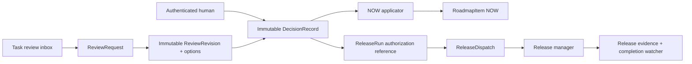
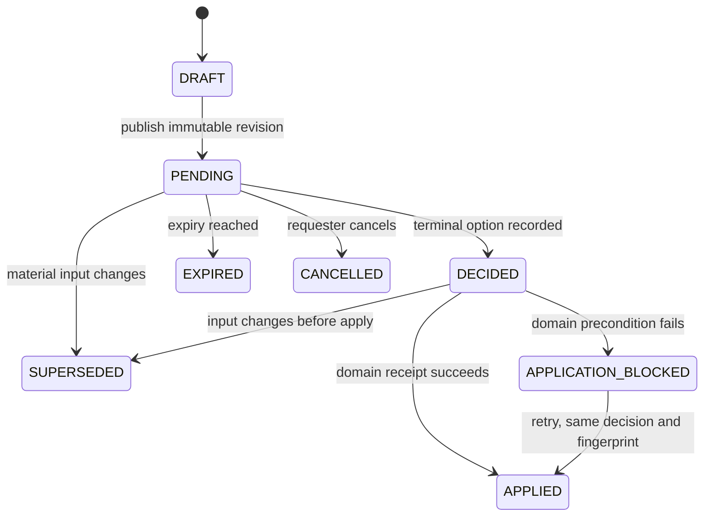

# ADR 0005 — Compass-Native Decision Gates and Immutable Decision Ledger

- **Status:** Accepted
- **Date:** 2026-08-31
- **Decision owner:** Rick Bowman
- **Scope:** Human decisions that authorize guarded Compass transitions, initially
  Roadmap admission to `NOW` and release authorization
- **Related:** Obsidian ADR-0004, “Explicit Human Authorization and Automated
  Release Lifecycle” (2026-08-30)

## Problem

Compass uses Tasks as its human review inbox, but it has no native, immutable
decision-record capability. For the Compass dogfood workspace, review requests
are therefore surfaced as Tasks while authoritative decisions are written to
Obsidian. This prevents a resolver from safely treating a Task status, comment,
or mutable Solution Plan status as authorization to move work into `NOW`.

ADR-0004 independently proposes a release-specific `ReleaseDecision`. Adding a
generic approval system beside it would create two answers to “what did the
human authorize?” The design must instead create one decision ledger while
preserving ADR-0004's stricter, SHA-bound release lifecycle.

## Constraints and success criteria

- A decision is an explicit human act, not an inferred Task, Roadmap, Solution,
  PR, or deployment state.
- Automation may prepare review packets and apply authorized continuations, but
  a service credential may not manufacture a human decision.
- The decision is bound to an immutable request revision and canonical
  fingerprint. A material change supersedes it rather than editing it.
- `NOW` admission and release authorization share record semantics, identity,
  idempotency, audit, and UI patterns; their eligibility checks and effects stay
  domain-specific.
- Release authorization remains bound to repository, PR, exact head SHA,
  environment, policy version, and sorted covered Task IDs as ADR-0004 requires.
- The initial design must fit Aurora DSQL: UUID keys, string discriminators,
  application-managed timestamps, no reliance on foreign-key enforcement, and
  additive/idempotent migrations.
- Existing UI actions and MCP tools currently permit direct Roadmap moves and
  Task completion. Guarded transitions must be centralized so UI, MCP, and
  automation cannot bypass the same invariant.
- Compass currently has only `MEMBER` and `ADMIN` workspace roles, with org
  owner/admin inheritance. The design must use the existing normalized role
  helpers rather than introduce a new RBAC system.

Done means a reviewer can inspect a stable packet, choose an option once, and
later prove which request revision, actor, role, rationale, and continuation
were authorized. A guarded domain operation accepts only a matching decision
and records an idempotent application receipt.

## Non-goals

- A generic workflow engine, approval DSL, voting/quorum system, or arbitrary
  user-defined automations.
- Replacing Tasks as the review inbox.
- Replacing GitHub checks, release manager, Vercel, or the delivery completion
  watcher.
- Treating Solution Plan `planStatus` as an immutable or authoritative gate.
- Automatically applying every decision. Each domain owns its continuation.

## Current architecture findings

- `RoadmapItem.horizon` is a plain string and all ordinary UI/MCP mutations can
  currently move an item directly to `NOW`; no commitment receipt exists.
- `Task.status` can move directly to `DONE`. A release-covered Task therefore
  needs the ADR-0004 completion guard in addition to this generic decision work.
- `SolutionComment.planStatus` is explicitly mutable, side-effect-free, and can
  be changed by agents. It is useful discussion context, not a decision ledger.
- UI authorization has reusable workspace/org-admin helpers. MCP authorization
  is centralized and fail-closed, but its trusted service actor currently has
  global access; decision-taking operations need a stricter human-actor rule.
- The MCP catalog validates inputs with Zod and has a completeness test requiring
  a gate for every registered tool. Mutating agent calls also receive a generic
  audit entry, which is useful telemetry but lacks decision semantics.
- Existing tests favor handler-level Vitest mocks, server-action auth tests,
  MCP schema/catalog tests, authorization-gate tests, and focused Playwright
  flows. The decision service should follow those seams.

## Options considered

| Option | Benefits | Costs / what it gives up |
|---|---|---|
| **A. One generic immutable decision ledger; domain-owned gates and continuations** | One source of decision truth; NOW and release share identity/audit semantics; release retains strict fingerprint and state machine; small reusable kernel | Adds several tables and requires centralizing formerly free transitions; each new gate still needs domain code |
| **B. Separate approval models per domain** (`NowCommitmentDecision`, `ReleaseDecision`, etc.) | Each schema is explicit and locally easy to understand | Competing semantics, duplicated auth/idempotency/UI, harder cross-domain audit, and likely drift over time |
| **C. Keep Tasks plus Obsidian as the permanent gate system** | Lowest immediate schema cost; preserves current routing | Task state is mutable, application is difficult to make atomic/idempotent, product cannot enforce gates itself, and every provider integration reimplements the contract |

## Decision

Adopt **Option A**: a small Compass-native decision kernel consisting of a
mutable review envelope, immutable revision/options, an append-only decision
record, and an idempotent application receipt. Domain services—not the generic
kernel—evaluate eligibility and apply effects.

Compass Tasks remain the human inbox. A Task may link to a Review Request, but
moving that Task to `DONE`, editing it, or commenting on it has no authorization
meaning.

### Conceptual records

| Record | Essential fields | Invariant |
|---|---|---|
| `ReviewRequest` | workspace, gate type, subject type/id, current revision ID, state, requested/assigned actor, due/expiry times | Mutable envelope only; never itself proves authorization |
| `ReviewRevision` | request, revision number, canonical fingerprint, title/summary, immutable packet JSON, required role, created time | Append-only; unique request + revision and request + fingerprint |
| `ReviewOption` | revision, stable action key, label, outcome class, continuation key, sort order | Frozen with its revision; options cannot be changed after publication |
| `DecisionRecord` | request/revision/option, fingerprint, human user ID, actor/role snapshot, rationale, idempotency key, decided time | Append-only; exactly one terminal decision per revision; no update/delete API |
| `DecisionApplication` | decision, domain continuation key, target type/id, status, receipt key, attempts/error, applied time | Unique decision + continuation; retries return the same receipt |

`packet JSON` is an immutable display/audit snapshot, not the authoritative
domain object and not executable instructions. Frequently filtered identifiers
and states remain normalized columns. Domain tables may store a nullable
`decisionRecordId` reference where fast invariant checks are required; because
DSQL uses application-level relations, the service validates workspace and
target ownership explicitly.

Suggested initial gate and action keys are deliberately closed sets in
TypeScript/Zod, stored as strings in DSQL:

```text
gateType: NOW_COMMITMENT | RELEASE_AUTHORIZATION
outcomeClass: APPROVE | REJECT | REQUEST_CHANGES | DEFER
continuationKey: ADMIT_ROADMAP_ITEM_TO_NOW | DISPATCH_RELEASE_RUN
```

Adding a gate type requires a named domain policy and applicator. The system
must not expose “run arbitrary continuation from JSON.”

### Shared decision invariants

1. The reviewer decides an exact `ReviewRevision.id` plus fingerprint and
   `ReviewOption.id`; the server reloads all three before insert.
2. The authenticated user must satisfy `requiredRole` using normalized workspace
   and inherited org roles. The decision stores the evaluated role snapshot.
3. MCP may expose read/prepare/apply operations to automation. A take-decision
   MCP operation, if provided, rejects the global service actor and accepts only
   a per-user API key whose user satisfies the role. The primary UI uses Auth.js.
4. A repeated request with the same idempotency key returns the original
   decision. A competing terminal response for the same revision loses the
   uniqueness race and returns the existing result.
5. Changes to material input create a new revision/fingerprint and mark the old
   revision superseded. Old decisions remain readable but cannot be applied.
6. Decisions are never updated or deleted. Corrections use a new revision and
   decision (or an explicit revocation decision where the domain permits it).
7. `DecisionApplication` is not another approval; it is an operational receipt
   proving that one domain continuation consumed one decision.

### NOW commitment specialization

The Roadmap service owns the `NOW` eligibility packet and effect.

The fingerprint includes at least workspace ID, Roadmap Item ID, source Solution
ID, opportunity ID, current investment-stage evidence/decision references,
owner, capacity inputs, portfolio-policy version, requested horizon, and any
declared displacement item. Missing required data produces no approvable
revision.

All paths entering `NOW`—board move, item creation, promotion from Solution or
Feedback, generic entity editing, and MCP handlers—must call one centralized
`admitToNow` domain operation. A bare horizon write fails with a link to the
pending review. The operation reloads the item and policy inputs, recomputes the
fingerprint, verifies an approved `ADMIT_ROADMAP_ITEM_TO_NOW` decision, changes
the horizon, and writes the application receipt idempotently. Moves out of
`NOW` remain ordinary corrective actions unless a later policy says otherwise.

Legacy `NOW` rows are not backfilled with invented approvals. They receive an
explicit provenance such as `LEGACY_UNGATED` (or are reported as such until a
native commitment is made).

### Release authorization specialization and ADR-0004 reconciliation

ADR-0004's release state machine, `ReleaseRun`, covered Task set, dispatch,
provider evidence, external-merge provenance, production verification, and
completion watcher remain unchanged.

Its proposed `ReleaseDecision` is replaced by a reference to the shared
`DecisionRecord` whose:

- `gateType` is `RELEASE_AUTHORIZATION`;
- option continuation is `DISPATCH_RELEASE_RUN`;
- immutable revision packet contains the human-readable release review packet;
- fingerprint is ADR-0004's canonical hash over workspace, provider/repository,
  PR, base, exact head SHA, target environment, policy version, and sorted Task
  IDs.

`ReleaseRun.authorizationDecisionRecordId` points to that record.
`ReleaseDispatch` points to the same decision and remains the durable outbox.
`ReleaseEvent` remains provider/state evidence. Thus there is one approval
truth, while release keeps the additional machinery justified by its risk.

The ADR-0004 action remains explicitly named **Approve & release**. It must not
be rendered as a generic “Approve” button merely because the persistence layer
is shared.



### Lifecycle



For release, this shared lifecycle describes the authorization slice only;
`ReleaseRun` continues through merging, deploying, verifying, and released.

## Interface boundaries

Recommended service/API operations:

- `prepareReviewRequest(gateType, subjectId)` — domain policy builds/reuses a
  revision and its options.
- `getReviewRequest(id)` / `listReviewRequests(workspaceId, state, assignee)`.
- `recordDecision(revisionId, fingerprint, optionId, rationale,
  idempotencyKey)` — human-only mutation.
- `applyDecision(decisionId)` — dispatches to a registered domain applicator;
  safe for automation and retry.
- Domain convenience operations such as `requestNowCommitment(itemId)` and
  `approveAndRelease(runId, expectedFingerprint)` may compose the kernel but
  retain clear product language.

The MCP catalog should initially expose preparation/read/application tools, not
a service-key-capable approval shortcut. Every tool receives an explicit entry
in `mcp-tool-gates.ts`; review entities are added to `WorkspaceEntityType` for
workspace-scoped authorization. Decision-taking must use a dedicated gate that
requires a non-service actor and the revision's required role.

## Migration and rollout

1. Add the generic records and read-only review surfaces. Keep Obsidian as the
   configured authoritative provider during verification.
2. Implement `NOW_COMMITMENT` preparation, human decision, and centralized
   `NOW` applicator. Block every direct entry path to `NOW` only after migration
   inventory and tests prove coverage.
3. Implement ADR-0004 release tables/state machine using the generic
   `DecisionRecord` reference rather than a separate `ReleaseDecision` table.
4. Add an Obsidian export adapter that writes a human-readable mirror after the
   Compass transaction. The mirror is archive/reporting, not a second decision
   authority. Adapter failure is retried and visible but cannot alter the
   immutable Compass record.
5. Change `pm-config.md` `decision_records` from `obsidian` to the Compass-native
   provider only after contract tests demonstrate immutable reads, idempotent
   writes, role attribution, supersession, and application receipts. Existing
   Obsidian decisions remain authoritative historical records and may be
   referenced by external provider ID; do not fabricate native decisions.

This cutover is explicit. Dual-authoritative writes are forbidden.

## Verification strategy

- Schema tests for DSQL-compatible fields, indexes, and uniqueness constraints.
- Decision-service unit tests: authorized/unauthorized actor, service-actor
  denial, stale fingerprint, double submit, conflicting submit, supersession,
  expiry, immutable records, and idempotent application.
- NOW domain tests covering every existing ingress path (create, promote, board,
  server action, MCP, generic field mutation), legacy provenance, capacity and
  displacement changes, and transaction retry after ambiguous commit.
- Release contract tests for exact SHA/scope binding, changed fingerprint,
  revocation-before-claim, one dispatch, external merge provenance, production
  correlation, and `DONE` completion receipts.
- MCP Zod schema, catalog registration, structured output, fail-closed gate
  completeness, cross-workspace denial, and per-user versus service-key tests.
- UI server-action auth tests plus Playwright coverage for packet inspection,
  explicit action copy, concurrent/stale response, and live status display.
- Migration/backfill tests proving legacy `NOW` and historical Obsidian records
  are not relabeled as native approvals.

## Consequences

Compass gains one durable decision vocabulary and can become the configured
decision provider for its own workflows. Review UX and audit queries become
consistent across product and release gates, while domain teams retain explicit
control over eligibility and side effects.

The cost is that formerly permissive mutations must pass through domain
services, and Compass owns an append-only ledger plus provider-export retries.
The model intentionally does not solve multi-reviewer quorum; introducing that
later would require a policy layer over multiple Decision Records, not changing
the meaning of one record.

## Risks and revisit triggers

- **Riskiest assumption:** one human decision per revision is enough for the
  solo/small-team target. Revisit for separation-of-duties or quorum needs.
- Application-enforced immutability can regress if generic CRUD is generated for
  ledger tables. Keep them out of generic entity mutation paths and consider a
  restricted database role if compliance needs increase.
- JSON packets can become an accidental dumping ground. Keep policy-relevant
  fields normalized or fingerprinted and version every packet schema.
- Cross-workspace polymorphic IDs can be misbound without database FKs. Every
  prepare/read/apply path must resolve ownership and compare workspace IDs.
- A Compass-to-Obsidian mirror may look authoritative to humans. Mark exports
  with native decision ID, checksum, and `mirror: true` after cutover.
- Revocation semantics differ by domain: NOW can usually be moved out, while a
  claimed/merged release cannot be “unreleased.” Revocation remains a
  domain-defined option, not a universal state transition.

Revise this decision if product requirements demand multi-party voting,
cross-workspace gates, user-defined continuations, compliance-grade database
immutability, or release trains. None is required for the present problem.
