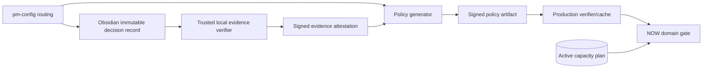
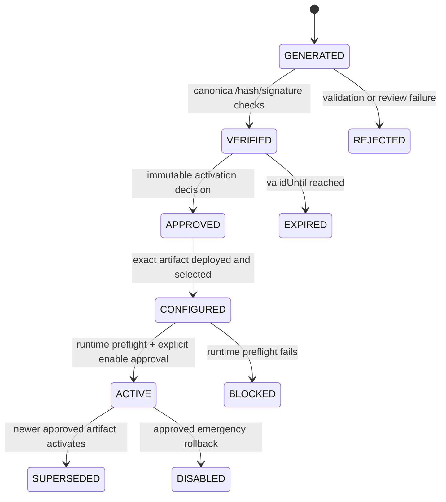

# ADR-0006: Expand-First Decision Authority and Generated Policy Artifacts

**Date:** 2026-09-01

**Status:** Proposed

**Decision owner:** Rick Bowman

**Scope:** The expand-only precursor for native decision gates and the later
production authority/configuration path

**Related:** ADR-0005, Compass-native decision gates; the Agentic PM human-review
contract and Obsidian decision-record adapter

## Problem statement

Compass needs schema and operational foundations for immutable decision gates
without making the current application depend on un-migrated tables or enabling
`NOW` enforcement prematurely. A later contract phase must also prove that a
Building-investment decision came from the workflow provider configured in
`Products/Compass/pm-config.md`.

For the Compass workspace, routing resolves as follows:

- `roadmap` is authoritative in `compass_roadmap`;
- `review_requests` are presented through `compass_tasks`;
- `decision_records` are authoritative in **Obsidian**, under
  `Products/Compass/Reviews/Decisions/`;
- `automation_runtime` and notifications use Geode.

The default `compass_solution_plan_status` decision adapter is explicitly not
valid for `NOW`, release, security, billing, or destructive gates. Tasks,
Solution Plan state, comments, application logs, and generated configuration
therefore cannot substitute for an Obsidian decision record.

Production Vercel functions cannot and should not mount Rick's local Obsidian
vault. The architecture needs a verifiable bridge that preserves Obsidian as
the authority without making live requests depend on a laptop or silently
copying authority into mutable runtime configuration.

## Constraints

- This precursor may add migrations 039–041, health reporting, and an
  authenticated operator path for capacity plans only.
- It must not enforce `NOW`, intercept ordinary Roadmap mutations, dispatch a
  release, or make ordinary routes depend on the new schema.
- The precursor must be safe to deploy before migrations are applied.
- Aurora DSQL requires UUID keys, application-managed timestamps, no assumed
  foreign keys or cascade behavior, one DDL operation per transaction, bounded
  writes, and asynchronous indexes.
- Existing `NOW` rows must not be assigned invented decisions.
- A service credential may generate, verify, or apply an already-authorized
  continuation, but it may not manufacture a human decision.
- Provider changes, source changes, and policy changes must fail closed.
- Production policy configuration, capacity activation, runtime enforcement,
  production migration, deployment, and merge remain separately approved
  operations.

## Success criteria

The precursor is successful when an operator can safely:

1. inspect migration and asynchronous-index state;
2. create or recover an identical draft capacity plan;
3. reconcile legacy `NOW` rows into reservation receipts without changing any
   Roadmap row;
4. inspect drift and capacity before activation;
5. explicitly activate the reconciled plan through an authenticated,
   idempotent operation;
6. run the existing application normally before and after the migrations with
   no decision-gate runtime behavior.

The later contract phase is successful when production can validate a
content-addressed policy and investment-evidence attestation generated by the
configured Obsidian verifier, bind it to an active capacity plan, and enforce
all entries into `NOW` through one fail-closed domain operation.

## Non-goals

- Treating the precursor as a partial runtime gate.
- Reading Obsidian directly from Vercel.
- Importing Obsidian decisions as new native decisions.
- Using a Task status, Solution Plan status, comment, policy file, signature, or
  capacity plan as proof of human investment authorization.
- Applying production migrations or activating production capacity as part of
  merging the precursor.
- Implementing quorum, voting, an approval DSL, arbitrary continuations, or a
  general policy engine.

## Options considered

### Precursor rollout shape

| Option | Benefits | Costs and risks |
|---|---|---|
| Ship migrations together with runtime enforcement | One PR and one conceptual release | Deploy-before-migrate failures, difficult rollback, and mixed schema/runtime incident modes |
| Apply migrations manually before any supporting application code | Existing app remains compatible with additive DDL | Weak health evidence and no bounded, repeatable capacity reconciliation path |
| **Expand-only precursor, then contract phase** | Separates schema/index health and data reconciliation from enforcement; old and new app versions remain usable | Requires a deliberate two-release sequence and temporary dormant tables |

Use the **expand-only precursor**.

### Production access to Obsidian authority

| Option | Benefits | Costs and risks |
|---|---|---|
| Vercel reads the vault live | Always reads current source | Requires exposing a local filesystem/service to production; creates availability and security coupling |
| Copy selected fields into an environment JSON document | Easy to deploy | Mutable copy can look authoritative; provenance and canonicalization are unverifiable |
| Import every Obsidian record into native `DecisionRecord` | Native queries and joins | Creates two apparent authorities and changes historical identity |
| **Trusted verifier emits a signed, content-addressed attestation and policy artifact** | Obsidian remains authoritative; production verifies offline; artifacts are reproducible and reviewable | Requires canonicalization, key custody, generation tooling, and explicit artifact activation |

Use the **trusted verifier and generated artifact** approach.

### Artifact integrity

| Option | Benefits | Costs and risks |
|---|---|---|
| SHA-256 only | Deterministic identity and corruption detection | Anyone able to replace artifact and expected hash can forge provenance |
| Git commit identity only | Existing review/deploy history | Does not independently prove the artifact came from the configured evidence verifier |
| HMAC | Simple verification | Production must hold a signing secret capable of forging artifacts |
| **Ed25519 signature plus SHA-256 and Git review** | Public verification, compact native Node support, independent provenance and review history | Private-key custody and rotation procedure required |

Use **Ed25519 + SHA-256 + Git review**. The signature proves which verifier
emitted the artifact; it does not prove human approval. Human approval remains
an immutable decision record referenced by the artifact.

### Artifact selection and activation

| Option | Benefits | Costs and risks |
|---|---|---|
| Mutable environment variable points to an artifact | Operationally simple | Pointer changes are difficult to review and can select a different valid artifact without a code diff |
| Database activation row | Transactional and easy to query | Requires another authority-bearing mutation path and a bootstrap schema beyond the precursor |
| **Signed, generated activation manifest committed with the artifact** | Selection, mode, decision checksum, and rollback are reviewed together and bound to a deployment SHA | Policy activation requires a small generated-policy PR and redeploy |

Use a **signed generated activation manifest**. An unsigned environment value
may disable enforcement for emergency rollback, but it may never select a new
artifact or turn enforcement on.

## Decision

### 1. Expand-only precursor boundary

The precursor contains only:

- additive, idempotent migrations `039_native_decision_gates`,
  `040_release_authorization`, and `041_portfolio_capacity_ledger`;
- bounded migration/backfill execution and migration/index health reporting;
- an authenticated operator-only capacity-plan API/service supporting
  `create`, `reconcile`, `activate`, and `inspect`;
- tests and documentation for those operations;
- the baseline migration-028 E2E setup correction.

It explicitly excludes:

- `NOW` eligibility, preparation, decision taking, or application;
- Roadmap mutation interception;
- reservation release from ordinary Roadmap updates;
- decision/release UI, MCP tools, or ordinary server actions;
- release dispatch or external provider calls;
- production policy parsing or an enforcement feature flag.

The new tables are **dormant operational state** until the contract phase. An
`ACTIVE` capacity plan means only that reconciliation completed and the plan is
eligible to be referenced later; it grants no Roadmap transition.

#### Deploy-before-migrate compatibility

The precursor's generated Prisma client must not cause ordinary queries to
select new scalar columns before migration 039 exists. In particular,
`RoadmapItem.nowCommitmentProvenance` and
`RoadmapItem.nowDecisionRecordId` must not be added to the precursor Prisma
model unless every ordinary Roadmap query is proven not to select them. The
preferred precursor shape is:

- migration SQL contains the additive Roadmap columns for forward
  compatibility;
- the precursor Prisma schema exposes the new operator-owned models and only
  relation fields that Prisma does not select by default;
- the two new Roadmap scalar columns remain absent from the Prisma model until
  the contract release, after production migration health is green.

Adding relation-array fields to existing models is acceptable because Prisma
does not fetch relations implicitly. Adding scalar fields is not equivalent:
default model reads select scalar columns and would create a hidden
deploy-before-migrate dependency.

No module imported by an ordinary route may import or initialize the capacity,
review, decision, or release services. The admin endpoint is the only runtime
entry point to the precursor state.

### 2. Migration and index health contract

Health reporting is authenticated with the existing non-empty
`MIGRATION_SECRET` boundary and is read-only. It reports, per active schema:

- migration manifest entry and application status;
- required table and column presence;
- bounded provenance-backfill counts, including unknown/null classifications;
- required index name and observed DSQL state (`CREATING`, `ACTIVE`, `FAILED`,
  or unavailable);
- a top-level readiness result that is false for missing/failed indexes and
  remains pending while an async index is creating;
- capacity-plan counts and drift summaries without exposing secrets or policy
  contents.

Unknown catalog state is not reported as healthy. The migration endpoint may
apply idempotent DDL, but health and apply remain distinguishable operations so
a monitor never mutates data.

Migration 039 classifies legacy `NOW` rows as `LEGACY_UNGATED`; it does not
invent or link a Decision Record. The add/default/backfill/not-null sequence is
split into DSQL-safe transactions and the backfill is bounded and recoverable.
Migrations 040–041 add tables and async indexes only. Foreign-key-like ownership
and identity checks remain application invariants.

### 3. Capacity operator contract

The capacity path is authenticated by `MIGRATION_SECRET`, never exposed through
an ordinary route or the general MCP service actor, and accepts an explicit
idempotency key for mutations.

#### Create

Input includes workspace ID, canonical `policyId`, unit, available units,
units per `NOW` item, and `nowLimit`. The service validates positive bounded
integers, supported unit (`FOCUS_SLOT` in v1), and workspace existence.

The stable identity is `(workspaceId, policyId)`. Repeating an identical create
returns the existing plan. Reusing that identity with different semantic
fields fails with `IDEMPOTENCY_CONFLICT`; it never edits the existing plan.
Plans start in `DRAFT`.

#### Reconcile

Reconciliation reads current Roadmap items with `horizon = NOW` in stable ID
order and inserts one reservation per item with `decisionRecordId = null`.
These are migration receipts for existing commitments, not authorizations.
Writes are split to stay within DSQL row/byte limits and use unique constraints
plus compare-and-swap plan versions for retry safety.

Re-running reconciliation is a no-op for existing reservations. It does not
change Roadmap horizons, statuses, ordering, ownership, or provenance.

#### Inspect

Inspection returns the plan fingerprint/state/version and independently
calculates:

- current `NOW` item IDs and count;
- active reservation IDs/count/units;
- missing reservations;
- reservations whose item is absent, not `NOW`, or in another workspace;
- duplicate/cross-plan ownership conflicts;
- effective capacity `min(availableUnits, nowLimit)` and excess amount;
- whether activation preconditions hold.

Inspection is always read-only and safe before, between, and after reconciliation
batches.

#### Activate

Activation requires an explicit action and expected plan version/fingerprint.
It re-runs the full inspection in the activation transaction. It succeeds only
when every current `NOW` item has exactly one active reservation owned by the
draft plan, no stale/cross-workspace reservation exists, and reserved units do
not exceed either limit.

Only one plan may be active for a workspace. Because DSQL cannot express all
of this as an exclusion constraint, activation uses a workspace-scoped
compare-and-swap check and rejects an existing active plan. A retry with the
same key returns the activated plan; a competing activation fails closed.

Activation does **not** enable runtime enforcement. The later contract release
must separately bind an exact plan ID and fingerprint into an approved policy
artifact.

### 4. Production authority chain

The authority chain has five distinct roles:



1. **Routing authority:** `pm-config.md` resolves `decision_records` to exactly
   one provider. Its canonical routing fingerprint covers contract version,
   workflow profile, decision-record override, provider, and configured review
   root. Unrelated PM configuration is excluded.
2. **Human decision authority:** the immutable file in the configured Obsidian
   `Decisions/` folder contains the decision, rationale, reviewer, subject,
   source version, application status, continuation, receipt/result IDs, and
   timestamps.
3. **Evidence verifier:** trusted local tooling with vault access parses and
   validates that record using a versioned schema. It emits an attestation; it
   does not decide.
4. **Policy generator:** deterministic tooling combines canonical portfolio
   policy, routing fingerprint, verified attestations, and an exact capacity
   plan reference. It emits a canonical artifact and detached signature.
5. **Production verifier/cache:** production verifies the signature, hashes,
   schema/version, scope, and activation reference. It treats the artifact as a
   derived cache, never as the original human decision.

### 5. Obsidian evidence verification

For each Building-investment dependency, the verifier must:

1. resolve the review root from `pm-config.md`; never accept an arbitrary root
   supplied alongside the record;
2. search `Decisions/` by stable decision-record ID and idempotency key;
3. reject records outside the configured root, symlink/path traversal, duplicate
   IDs, malformed frontmatter, unknown fields that change semantics, or
   ambiguous multiple matches;
4. require the exact Solution ID and expected outcome
   `APPROVE_BUILDING` (or its versioned contract equivalent);
5. require `application_status: applied`, `applied_at`, a non-empty
   continuation, and a stable application receipt/result ID;
6. bind the decision to its review ID, reviewer, decided time, source version,
   and idempotency key;
7. canonicalize semantic fields with explicit defaults, sorted keys, normalized
   timestamps/UUIDs, and no prose/body whitespace;
8. compute `authorityChecksum = SHA-256(canonicalDecisionPayload)`;
9. emit the locator as vault-relative metadata for audit, never as authority;
10. re-read the file immediately before signing and fail if its bytes or
    semantic checksum changed during verification.

The verifier output includes `verifierVersion`, routing fingerprint,
decision-record ID, authority checksum, subject, outcome, source version,
application receipt, `verifiedAt`, and the source-file byte hash. The semantic
checksum is stable across harmless formatting; the byte hash makes subsequent
file edits visible.

An attestation is invalid if the underlying record is missing, moved outside
the configured provider root, changed semantically, no longer applied, or was
generated under a different routing fingerprint. Corrections create a new
Obsidian Decision Record and a superseding attestation; old artifacts remain
auditable.

### 6. Generated policy artifact

The canonical artifact is JSON with a versioned closed schema:

```json
{
  "schemaVersion": "compass-now-policy/v1",
  "artifactId": "now-policy:v1:sha256:<canonical-payload-hash>",
  "workspaceId": "<uuid>",
  "routingFingerprint": "sha256:<hash>",
  "portfolioPolicy": {
    "policyId": "portfolio-policy:v1:sha256:<hash>",
    "canonical": {}
  },
  "capacityPlan": {
    "id": "<uuid>",
    "fingerprint": "<sha256>",
    "expectedState": "ACTIVE"
  },
  "investmentEvidence": {},
  "generatedAt": "<RFC3339 UTC>",
  "validUntil": "<RFC3339 UTC>",
  "supersedesArtifactId": null,
  "activationDecision": {
    "recordId": "<Obsidian DEC id>",
    "checksum": "<sha256>"
  },
  "signingKeyId": "<stable key id>"
}
```

`investmentEvidence` is keyed by Solution UUID and contains only verifier
attestations, not hand-entered decision claims. The portfolio policy ID is a
schema-versioned SHA-256 over normalized behavior-affecting fields from
`pm-config.md`. The exact canonical payload excludes `artifactId` and detached
signature, then `artifactId` is calculated from that payload.

Generation is deterministic except for `generatedAt`/`validUntil`; reproducible
mode accepts explicit times and is used by tests. The generator refuses:

- unresolved or multiple decision providers;
- an authority other than the configured provider;
- missing or stale attestations;
- an uninspectable/non-active capacity plan;
- capacity drift or excess;
- an activation decision that does not authorize the exact policy ID, capacity
  plan fingerprint, evidence-set digest, workspace, and intended enforcement
  mode.

The artifact is committed at
`config/generated/decision-gates/<workspace-id>/<artifact-id>.json` with a
detached `.sig`. A signed
`config/generated/decision-gates/active.json` maps the workspace to the exact
artifact ID, mode (`shadow` or `enforce`), activation-decision checksum, and
superseded artifact. Both are reviewed in a distinct policy PR in the contract
phase and neither is edited by hand. The application refuses multiple active
selectors for one workspace.

CI regenerates the files from supplied fixtures/attestations where possible and
verifies canonical hashes and detached signatures. Production receives only
the public verification key; the private Ed25519 key remains in the configured
trusted local workflow, protected by the existing secret manager. Key rotation
uses overlapping public keys and explicit `signingKeyId`; revocation removes a
key only after every active artifact signed by it is superseded or enforcement
is disabled through an approved rollback. An emergency environment kill switch
may reduce `enforce` to `shadow` or `off`; it is one-way and cannot activate or
select policy.

### 7. Artifact lifecycle and approvals



Required pause points are separate:

1. approve and merge the expand-only precursor;
2. approve production deployment of the precursor;
3. approve migrations 039–041 after health preflight;
4. approve capacity-plan creation/reconciliation after inspecting inputs;
5. approve activation only after drift/capacity inspection;
6. approve the exact generated policy artifact digest and its immutable
   activation decision;
7. approve the contract-phase code merge/deployment;
8. approve enabling enforcement after production preflight and smoke tests.

Approval at one point grants no later action. In particular, activating a plan
does not configure policy, and configuring a policy does not enable enforcement.

### 8. Runtime fail-closed behavior in the later contract phase

The contract-phase gate rejects entry into `NOW` when any of these is true:

- enforcement is enabled but the artifact is absent, expired, malformed, or
  signed by an unknown/revoked key;
- artifact ID, payload hash, signature, routing fingerprint, provider, workspace,
  policy ID, or activation-decision checksum does not match;
- the referenced capacity plan is missing, not `ACTIVE`, has a different
  fingerprint, or has drift/excess;
- no attestation covers the exact Solution/source version;
- Obsidian evidence is stale or a provider change superseded the artifact;
- Roadmap source inputs changed after review preparation;
- any displacement or ownership prerequisite changed;
- a receipt lookup is ambiguous after a transaction retry.

Fail closed means “leave the item in its current horizon, return a typed blocker,
and create no partial receipt.” It never means delete, archive, or silently move
the item elsewhere.

Before enforcement is explicitly enabled, ordinary routes retain their current
behavior and do not load policy artifacts or gate tables. A missing precursor
table in that phase is a health problem, not an ordinary-route failure.

### 9. Reconciliation, audit, rollback, and supersession

- Capacity reconciliation is rerunnable and records reservations without
  rewriting Roadmap state.
- Every generator run records input digests, tool/verifier version, output
  artifact ID, signer key ID, and result. Secrets and full private source text
  are excluded.
- Every runtime authorization receipt records artifact ID, evidence attestation
  checksum, capacity-plan fingerprint, decision/revision ID, source fingerprint,
  and resulting Roadmap mutation.
- Policy changes create a new artifact with `supersedesArtifactId`; active
  artifacts are never edited.
- Corrected Obsidian decisions produce new decision records and attestations;
  historical records and artifacts remain intact.
- A provider-routing change immediately blocks generation under the old
  routing fingerprint and supersedes pending reviews. Existing applied receipts
  remain historical evidence.
- Rolling back the precursor code is safe after migrations because the schema
  is additive and dormant. Do not drop tables/columns during rollback.
- If a migration or index is unhealthy, stop before activation and repair with
  an additive follow-up migration.
- If capacity activation is wrong, runtime remains unaffected before the
  contract phase. Correct through a separately approved replacement plan; do
  not mutate historical reservations to disguise the error.
- If contract-phase enforcement causes errors, disable enforcement through the
  approved rollback control and redeploy the prior known-good application.
  Preserve all decisions, artifacts, plans, reservations, and application
  receipts for investigation.

## Later contract-phase boundary

The precursor is complete without any of the following. A separate reviewed
contract PR must add them:

- versioned Obsidian verifier and deterministic artifact generator;
- canonical policy and evidence schemas/test vectors;
- Ed25519 signing, public-key rotation, and artifact verification;
- explicit artifact selection/activation storage and audit;
- `DecisionEvidenceRef` persistence or an equivalently normalized attestation
  reference;
- runtime `NOW` preparation/decision/application services;
- one centralized `NOW` transition boundary used by UI, MCP, generic entity
  mutation, creation, and promotion paths;
- reservation release/correction semantics for leaving `NOW`;
- human-only decision-taking authorization;
- typed failure responses, idempotent application receipts, and concurrent
  transaction tests;
- operational monitoring and production smoke tests.

Release dispatch remains out of scope until its full merge/deploy/verification
evidence state machine is present. Migration 040's tables are dormant expansion,
not permission to merge or deploy anything.

## Consequences

### What becomes easier

- Schema/index failures and capacity drift can be diagnosed before runtime
  enforcement is exposed.
- The current application and a rolled-back build remain compatible with the
  expanded production schema.
- Production can later verify Obsidian authority without depending on a local
  filesystem at request time.
- Policy changes become content-addressed, reviewable, and supersedable.
- The difference between a human decision, verifier attestation, generated
  cache, capacity state, and application receipt remains explicit.

### What becomes harder

- Rollout has more explicit stages and approvals.
- The verifier/generator requires canonicalization fixtures and signing-key
  operations.
- Policy changes require generation and review instead of editing an env var.
- Provider or source-version changes invalidate cached artifacts and require
  regeneration.

### What we are giving up

- Immediate enforcement in the precursor.
- Live Obsidian reads from production.
- Convenience of treating mutable Compass state or configuration as approval.
- Destructive down-migration as the default rollback strategy.

## Risks

- **Riskiest assumption:** the configured Obsidian adapter's immutable fields
  and application receipt are sufficiently structured to canonicalize without
  interpreting prose. If real records lack those fields, fix the adapter
  contract or create a new decision; do not weaken verification.
- A signing key controlled by automation could emit a valid artifact without a
  human decision. Mitigation: signature proves generator provenance only, while
  an exact immutable activation decision is mandatory and independently
  checksummed.
- Generated artifacts may be mistaken for the source of truth. Mitigation:
  label them `derived_cache`, embed provider/routing identity, and link the
  immutable record IDs.
- DSQL cannot enforce every cross-table or single-active-plan invariant.
  Mitigation: compare-and-swap transactions, unique keys where available,
  independent inspection, and fail-closed activation.
- Async indexes may remain creating or fail after DDL returns. Mitigation:
  index-health polling is a migration exit gate, not informational telemetry.
- A future Prisma schema change could accidentally make ordinary routes depend
  on new scalar columns. Mitigation: a deploy-before-migrate compatibility test
  and changed-model query audit are required in both precursor and contract PRs.

## What would revise this decision

- A managed, authenticated Obsidian decision API becomes available with equal
  or stronger immutability and availability guarantees, making offline
  attestations unnecessary.
- Compass becomes the configured `decision_records` authority after an explicit
  provider migration, in which case new native decisions can be verified
  directly while historical Obsidian attestations remain valid evidence.
- Multiple reviewers or regulated non-repudiation become requirements, which
  would justify quorum and stronger identity/key infrastructure.
- Capacity can no longer be represented as workspace focus slots, requiring a
  versioned replacement capacity model rather than silently changing v1 units.
