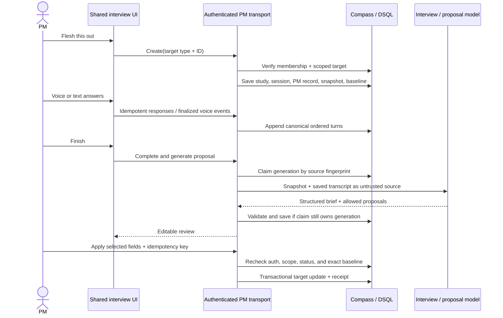

# ADR-0011: Authenticated PM Gather Interviews over the Research Session Engine

**Date:** 2026-09-11
**Status:** Accepted

## Context

Compass users can capture customer interviews and usability studies through a
public participant experience. That system already owns the difficult transport
and session concerns: canonical ordered turns, response idempotency, reload and
resume, bounded voice leases, provider provisioning, completion, and
deadline-bounded analysis claims.

A product manager also needs a guided way to clarify an existing opportunity,
solution, assumption, or experiment. The desired experience is a voice-first,
in-product interview that uses the selected item's bounded Compass context, asks
one question at a time, preserves the conversation, and proposes editable field
changes for explicit human application.

This is not customer research. Statements made by the PM are interpretations,
beliefs, contradictions, and open questions. Treating them as participant
evidence, increasing confidence, or running the existing customer-research
synthesis would corrupt the discovery record. Conversely, building a second
interview stack would duplicate the most failure-prone voice and persistence
behavior.

The approved outcome is that a PM can complete or resume an interview, review a
clearer definition with transcript support, and save selected improvements
without exposing internal context, overwriting concurrent edits, or changing
validation and lifecycle state.

## Constraints

- Reuse the current `ResearchStudy`, `ResearchSession`, `ResearchTurn`,
  `ResearchRequest`, voice-call, voice-event, and voice-command infrastructure.
- Preserve existing Capture URLs, public participant behavior, customer
  interview synthesis, and usability studies.
- Authenticate PM interviews through the Compass session and workspace
  membership. Public participant links must never grant access to one.
- A workspace member may read history. Only the initiating user may continue an
  interview, generate or edit its proposal, dismiss it, or apply it.
- Build context server-side from only the target, its parent chain, linked
  outcome, and directly linked evidence or feedback. Bound it, omit participant
  identities and unrelated workspace content, and disclose truncation.
- Store structured values as versioned, schema-validated JSON text, matching the
  existing research-analysis convention and avoiding an unbounded relational
  schema for model output.
- Aurora DSQL has no database foreign keys or triggers. Referential integrity,
  delete behavior, and `updatedAt` maintenance remain explicit application
  responsibilities; new indexes are asynchronous.
- Application must detect exact field drift because existing mutation paths do
  not all advance `updatedAt` consistently.
- Experiment protocol fields are writable only while the experiment remains
  `DESIGNING`.
- Migration and application rollout are separate gates. Production migration,
  flag enablement, deployment, merge, and launch are not implied by this ADR.

## Non-goals

- Creating assumptions or experiments from suggested next steps.
- Changing status, confidence, risk, scores, relationships, experiment results,
  or other lifecycle fields.
- Interview attachments, multiple simultaneous PMs, or live collaboration.
- A public or standalone PM-interview MCP surface.
- Counting a PM assertion as customer evidence or automatically promoting any
  interview output into discovery state.
- Replacing ordinary entity editing or the existing Capture study workflows.

## Options Considered

| Option | Pros | Cons |
| --- | --- | --- |
| Build a standalone PM interview domain and UI | Strong conceptual isolation; no public-token adaptation | Duplicates saved-turn ordering, idempotency, resume, voice leases, provider integration, cleanup, limits, and completion; creates two interview engines that will drift |
| **Add `PM_INTERVIEW` to research studies, a PM-specific companion record, authenticated transport adapters, and dedicated proposal analysis** | Reuses mature transport and transcript infrastructure; keeps authorization, target context, and apply receipts explicit; preserves one history surface | Requires carefully separating public and authenticated resolvers; shared services need capability-oriented inputs instead of assuming every session is participant-token driven |
| Generate a one-shot brief directly from an entity | Smallest schema and UI change | No guided interview, voice, saved conversation, resume, transcript references, or review-and-apply workflow; does not meet the approved outcome |

## Decision

Use the existing research session engine as the canonical conversation engine,
but introduce `PM_INTERVIEW` as an internal `ResearchStudy.studyType` with a
one-to-one PM interview companion record. The companion is the authoritative
boundary for workspace, initiating user, target, immutable source snapshot,
proposal generation, and apply or dismiss receipts.

PM interviews use authenticated workspace routes and a PM transport adapter.
Public participant routes and generic research creation/link tools reject
`PM_INTERVIEW`; no participant URL is issued. Existing chat and voice components
accept a transport adapter and a completion destination, so the public adapter
keeps current request shapes while the PM adapter calls authenticated endpoints
and finishes on the proposal review screen.

A dedicated prompt and structured-output contract produces a PM interview brief
and field proposals. It never calls the customer-research summary, coverage, or
cross-session synthesis path and never creates `Evidence`.

### Domain and persistence

Add an additive `PMInterview` record (database table name
`pm_interviews`) with these logical fields:

- identity and scope: `id`, `workspaceId`, unique `studyId`, unique `sessionId`,
  `initiatingUserId`, `targetType`, and `targetId`;
- immutable input: `contextSnapshotJson` and `fieldBaselineJson`;
- generation control: `generationState`, optional `generationClaimId`,
  `generationClaimedAt`, `generationFailureCode`, and `sourceFingerprint`;
- review output: nullable `proposalJson`;
- disposition: `disposition`, nullable `receiptJson`, `appliedAt`, and
  `dismissedAt`, plus nullable `dispositionIdempotencyKey`;
- audit: `createdAt` and explicitly maintained `updatedAt`.

`targetType` is allowlisted to `OPPORTUNITY`, `SOLUTION`, `ASSUMPTION`, or
`EXPERIMENT`. It is intentionally polymorphic because one PM interview has
exactly one target drawn from four existing tables. Since DSQL does not enforce
foreign keys, the PM interview service is the sole referential-integrity
boundary and uses the existing workspace entity-scope resolver before every
target operation.

The related research study and session remain the canonical home for the guide,
modality, status, transcript turns, idempotent response receipts, and voice
state. One PM interview creates one study and one session; it does not share a
study with other PM sessions. Internal participant-token rows may be allocated
where required by the shared voice engine, but they use a distinct internal kind,
are bound through the PM interview, and are never returned as a public token or
accepted by a public resolver.

`generationState` is one of `NOT_STARTED`, `GENERATING`, `READY`, or `FAILED`.
`disposition` is one of `PENDING`, `APPLIED`, or `DISMISSED`. A unique
`(id, dispositionIdempotencyKey)` receipt lookup supports replay without making
idempotency keys global across interviews.

Add nullable `Assumption.description`. Include it in ordinary detail reads and
the existing allowlisted entity edit path, and expose it through current
assumption MCP read/write contracts. This field is not PM-interview-specific
content after application; it becomes an ordinary editable assumption field.

All JSON documents carry a top-level `version`. They are parsed with strict
schemas at every read/write boundary:

- context snapshot: target fields, parent chain, linked outcome, directly linked
  evidence/feedback excerpts and IDs, explicit omissions, and capture time;
- field baseline: only fields the target type permits the proposal to change;
- proposal: interview brief, proposed values by allowlisted field, exact saved
  `ResearchTurn` references, open questions, suggested next steps, and explicit
  unknowns;
- receipt: idempotency key, human actor, selected fields, and before/after values,
  plus application or dismissal time.

The snapshot and transcript are delimited as untrusted source material in model
prompts, never interpolated as instructions. Customer evidence remains labeled
as external evidence; PM turns remain labeled as PM interpretation.

### Context boundary

Context assembly happens during PM interview creation, after session
authentication, workspace membership, and scoped target resolution. It captures:

- the selected target's editable fields and relevant non-editable state;
- the target's parent chain (solution to opportunity; assumption to solution to
  opportunity; experiment to assumption when present, then its parents);
- the opportunity's directly linked key result and objective when available;
- evidence directly related to the selected target and feedback directly linked
  to the relevant opportunity.

No broad workspace search is available to the interviewer. Context excludes
credentials, private operational data, unrelated entities, attachment storage
paths, and participant identity fields. Limits apply independently to item
counts, excerpt lengths, and total serialized size. The snapshot records counts
and reasons for omitted or truncated material so the PM can see what the
interviewer did not receive.

The snapshot is immutable after creation. A resumed interview therefore has a
stable conversational frame even if the live entity changes; live state is
reloaded only for the final comparison and application gate.

### Access and transport

The PM routes resolve four things together: signed-in user, current workspace
membership, the PM interview's stored `workspaceId`, and the target's scoped
workspace. A mismatch is returned as not found so entity existence is not
leaked.

Permissions are operation-specific:

- workspace members: read metadata, saved transcript, brief, proposal, and
  receipt history;
- initiating user only: start/resume, send chat responses, provision voice,
  write voice events, switch to text, complete, generate/retry, edit/select,
  apply, or dismiss;
- internal cleanup worker: terminate expired provider resources and release
  leases only, without receiving context or permission to continue conversation.

Existing research endpoints continue to resolve only active public participant
token kinds and only `CUSTOMER_INTERVIEW` or `USABILITY_TEST`. Research link
issuance/rotation and generic create/update tools reject `PM_INTERVIEW` even if
called by a workspace member. PM creation is available through authenticated UI
routes only in v1.

The reusable interview UI depends on an interface for start/resume, respond,
voice provision/events/release, completion, and destination. The public adapter
uses the existing token and resume-secret endpoints. The PM adapter relies on
the authenticated owner boundary and does not expose an internal participant
token. This keeps authorization out of presentation components and avoids
weakening the established public contract.

### Voice-to-text transition

Voice-to-text is a one-way state transition on the same session. The server:

1. marks the current voice call as disconnecting;
2. waits for all accepted finalized provider/browser transcript events to reach
   canonical `ResearchTurn` rows;
3. rejects the switch while a known pending utterance cannot be persisted,
   returning an explanation and an explicit discard option;
4. terminates provider/runtime resources and releases the exact lease;
5. compare-and-sets session modality to `CHAT` and records the retired lease ID.

Every subsequent voice event must present the active lease and voice modality,
so a late event from the retired lease is rejected. If the user explicitly
discards unpersistable pending speech, that fact is recorded as a transition
receipt rather than represented as a transcript turn. Reload reads the same
ordered canonical turns regardless of the original modality.

### Proposal contract

Allowed proposal fields are fixed by target type:

| Target | Allowed fields |
| --- | --- |
| Opportunity | `title`, `description`, `customerSegment` |
| Solution | `title`, `description` |
| Assumption | `title`, `description` |
| Experiment | `title`, `hypothesis`, `method`, `killCondition` (only while `DESIGNING`) |

The model may return only these keys. Server validation also enforces normal
field length and nullability rules, verifies every transcript reference belongs
to this session, and retains explicit unknowns rather than inferring values.
Suggestions to create child assumptions or experiments appear only in
`suggestedNextSteps`.

No generated proposal includes or mutates lifecycle status, confidence, risk,
relationships, score values, evidence, or experiment results.

### Generation concurrency

Proposal generation follows the existing research analysis deadline/claim
pattern:

1. Build a source fingerprint from the immutable snapshot plus the ordered
   saved transcript IDs, roles, sequences, and contents.
2. In a transaction, compare-and-set `generationState` to `GENERATING` with a
   unique claim ID and claim time. A non-expired competing claim returns `409`;
   an expired claim may be replaced.
3. Run the dedicated structured-output agent under the analysis deadline.
4. Validate the output and compare-and-set by interview ID, claim ID, state, and
   source fingerprint before storing `proposalJson` as `READY`.
5. On failure, compare-and-set the same claim to `FAILED`, keep the transcript
   and any prior valid proposal unchanged, and permit explicit retry.

Duplicate completion is therefore harmless, and retries cannot allow a late
generation to replace a newer one.

### Application concurrency and idempotency

Applying selected changes is one DSQL transaction. Inside it, the service
rechecks current membership, initiating-user ownership, PM interview
disposition, target existence and workspace scope, selected field allowlists,
and (for experiments) current `DESIGNING` status.

It then compares the current value of every baseline field to
`fieldBaselineJson`. `updatedAt` is advisory only. If any baseline field differs,
the transaction writes a refreshed comparison into the retained proposal,
leaves target fields untouched, and returns a stale-review response. The user
must review against the new baseline before another application attempt.

If the baseline still matches, the transaction updates only selected fields,
explicitly advances the target's `updatedAt` and actor audit fields where
supported, and writes the immutable before/after receipt while moving the
interview disposition from `PENDING` to `APPLIED`. The receipt's unique
idempotency key makes an exact repeated request return the existing result.
A different request after application is rejected. Any target or receipt write
failure rolls back the entire operation.

Dismissal similarly compare-and-sets `PENDING` to `DISMISSED` and stores its
actor receipt without touching the target. Deleting a target does not delete the
PM interview: workspace members can still read its snapshot, transcript,
proposal, and receipt, but apply is disabled.

## Data flow

## Migration, rollout, and rollback

Create one registered additive DSQL-compatible migration containing:

- nullable `assumptions.description`;
- the `pm_interviews` table;
- asynchronous indexes/unique constraints for study, session, workspace/history,
  generation claims where required, and apply idempotency.

The migration runner must execute DDL in its established DSQL-safe statement
boundaries and wait for required asynchronous indexes before reporting the
feature ready. Verification covers first application, repeated application,
registered-manifest parity, catalog postconditions, and isolated-schema cleanup.

Rollout order is:

1. merge/deploy code with PM entry points and endpoints disabled;
2. inspect the authenticated migration endpoint and apply only the named PM
   interview migration;
3. verify column/table/index postconditions and repeat-application safety;
4. enable authenticated PM endpoints and entry points in preview;
5. run authenticated text and voice journeys plus existing Capture regressions;
6. separately approve production enablement.

PM interview entry points and endpoints use a dedicated feature flag. Voice also
requires the existing research browser-voice setting; text remains available
when voice is off.

Rollback disables the PM interview flag and leaves additive storage, transcripts,
and receipts intact. Applied entity text remains ordinary user-editable content
and can be corrected using the saved before/after receipt. No rollback deletes
history or attempts automatic reversal after subsequent human edits.

## Consequences

### Positive

- One canonical transcript and voice engine serves both external research and
  internal PM clarification without conflating their meaning.
- Internal workspace context never crosses the public participant-token
  boundary.
- Exact field-baseline comparison protects against legacy mutation paths that
  fail to update timestamps.
- Saved source snapshots and before/after receipts make generation and human
  application auditable after target deletion or later editing.
- Additive schema and independent feature gating provide a reversible rollout.

### Negative

- The research domain now supports two access modes, so transport-neutral core
  services and explicit route rejection tests become permanent maintenance work.
- The polymorphic target cannot use a database foreign key; application code
  owns target validation and deletion semantics.
- Snapshot stability means a resumed interview may discuss context that has
  since changed. The review comparison, not the conversation, is where current
  truth is reconciled.
- Versioned JSON is simpler to evolve but is less directly queryable than fully
  normalized proposal and receipt tables.

## Risks and mitigations

| Risk | Mitigation |
| --- | --- |
| Internal context is exposed through a copied token or public route | No share token issuance; public resolver rejects study type and internal token kind; anonymous, wrong-workspace, copied-token, and removed-membership tests |
| PM statements are counted as validation | Dedicated prompt/output parser and no call to research synthesis or Evidence creation; database assertions that evidence, status, confidence, risk, score, relationships, and results are unchanged |
| Concurrent edits are overwritten | Compare every live allowlisted field to the stored baseline inside the apply transaction; stale proposal remains reviewable |
| Voice fallback loses or reorders answers | Canonical finalized turns, lease-fenced switch, pending-speech disclosure/discard receipt, and late-event rejection |
| Duplicate generation or apply competes | Deadline-bounded generation claims, source fingerprints, compare-and-set completion, unique apply idempotency receipt |
| Deleted or moved targets break history | Workspace-scoped companion record and immutable snapshot remain readable; target relation is intentionally soft and application is disabled |
| Shared Capture behavior regresses | Keep separate adapters and run the existing customer interview, usability, attachment, chat, voice, reconnect, completion, and synthesis suites |

## Riskiest assumption

The riskiest assumption is that the existing research session and voice services
can be made access-mode-neutral without accidentally weakening the public
participant boundary. This decision is valid only if authenticated PM routes can
reuse canonical transcript and voice operations through explicit capabilities,
while every public resolver remains unable to resolve `PM_INTERVIEW` studies or
their internal token records.

The release gate is adversarial cross-mode coverage, not merely a successful PM
happy path.

## Verification obligations

- Parameterized launch, interview, review, edit/select, apply, and entity-readback
  journeys for all four targets.
- Dismissal, generation failure/retry, deleted target, stale exact baseline with
  unchanged timestamp, changed experiment state, duplicate apply, and
  transactional rollback.
- Anonymous, copied internal token, public-route, wrong-workspace, membership
  removal, non-owner continuation/application, and member history-read cases.
- Reload/resume, reconnect, ordered turn persistence, unavailable microphone,
  pending-caption failure, explicit discard, lease release, late-event rejection,
  and one-way voice-to-text continuation.
- Database assertions proving no Evidence or forbidden target fields changed.
- Existing Capture and Roadmap journeys, full unit/integration suites, lint,
  types, build, UI primitive/color guards, explicit CI inclusion, and synthetic
  desktop/mobile screenshots.
- Deterministic provider fixtures in automation and an explicit record of whether
  a real voice-provider preview smoke test was performed.

## Revision triggers

Revisit this decision if:

- PM interviews require multiple collaborators or multiple sessions per target
  conversation;
- public and authenticated transports cannot share core services without route
  conditionals that obscure authorization;
- proposals need independent querying, approvals, or a lifecycle too complex for
  versioned JSON snapshots;
- exact baseline comparison is insufficient because target updates expand to
  related records or rich-text merge semantics;
- voice provider semantics cannot guarantee final-event settlement before a
  modality transition;
- PM interview outputs are later allowed to create evidence or child entities,
  which requires a separate provenance and human-decision design.
