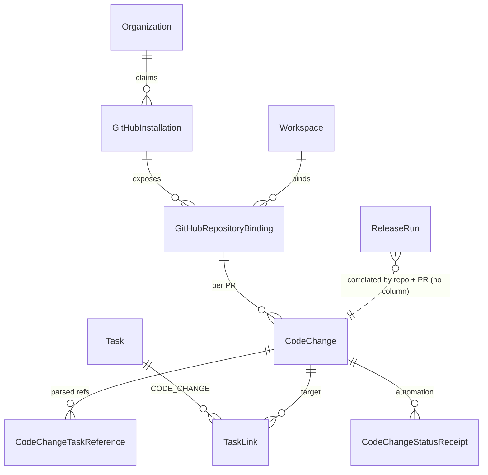

# ADR-0017: Compass GitHub App: linking pull requests to Tasks and syncing delivery state

**Date:** 2026-09-25
**Status:** Proposed
**Decision owner:** Rick Bowman
**Product context:** Opportunity `6353c272-f839-4e27-8db7-c24c1b647732` ("Compass Tasks can't
see what's happening in code"), Solution `a84e9750-8c9c-4d36-96f0-842e4dd8d629`
**Related:** ADR-0004 (vault, *Explicit Human Authorization and Automated Release
Lifecycle*, Proposed), ADR-0005 (release-authorization slice, migration
`040_release_authorization`), ADR-0007 (application-enforced integrity), ADR-0009 and
ADR-0015 (agent identities and credentials), ADR-0016 (workspace update events)

> This record proposes a design. It does not authorize implementation, a migration, a
> GitHub App registration, or any change to release authority.

## Context

### The problem

A Compass Task cannot see what is happening in code. PR, CI, review and deployment
state live only in GitHub. Two workarounds fill the gap today:

1. **The `delivery-completion-watcher` skill** runs on a schedule. It polls `gh` for PR,
   check and deployment state and then reconciles Tasks. It is slow (the polling
   interval), costly (a model turn for each sweep), and fragile, because its linkage
   depends on agents having written PR URLs back into Task descriptions.
2. **Agents paste PR, CI and deploy URLs into Task descriptions as prose.** Nothing about
   that data is structured, queryable, or kept current.

**Desired outcome.** A Task's delivery state (PR opened → checks → review → merged →
deployed) appears in Compass within minutes, with no manual pasting and no polling
reconciliation. Every PR traces back to the Task it serves.

### What the code says today

These findings come from `main` at `f02b8d5`:

- **`Task`** has a free-form status string (`BACKLOG | TODO | IN_PROGRESS | BLOCKED |
  IN_REVIEW | DONE | CANCELLED`). `moveTaskStatus` in `lib/task-tool-handlers.ts` accepts
  any transition and has no release guard, so ADR-0004 invariant 5 ("DONE is rejected
  while covered by an unreleased ReleaseRun") is **not implemented**. Roadmap delivery
  status is *derived* from linked Task statuses (`lib/roadmap-delivery-status.ts`), so any
  automatic Task transition reaches the roadmap too.
- **Tasks have no short human key** (nothing like `CMP-142`). A Task's only stable
  identifier is its UUID.
- **`TaskLink`** is a polymorphic many-to-many edge (`taskId`, `linkedType`, `linkedId
  UUID`, `source`, `createdById`). Every current target is a Compass entity in the same
  workspace, and `validateTaskLink` enforces that. `linkedId` is a UUID, so a GitHub PR
  (identified by `owner/repo#number`) cannot be a direct target. It needs a Compass row.
- **`ReleaseRun`** records PR identity as `provider`, `repositoryOwner`, `repositoryName`,
  `pullRequestNumber`, `baseRef` and `headSha`, and binds those into an immutable
  `sourceFingerprint`. The schema comment says provider evidence and merge, deploy and
  verification state were "intentionally deferred". In the code, no path moves a run
  past `DISPATCH_QUEUED`.
- **`ReleaseSourceRevalidator`** is the seam for authoritative PR re-reads. Both
  production callers (`lib/decision-tool-handlers.ts` and `reviews/actions.ts`) pass
  `unconfiguredReleaseSourceRevalidator`. That revalidator fails closed with
  `PR_NOT_READY`, so **every attempt to queue a release is blocked today**. A
  provider-backed revalidator is the missing piece, and this App is its natural home.
- **No inbound webhook route and no scheduler.** The repo has no `vercel.json` crons and
  no `/api/**/webhook`. Unauthenticated machine routes must be listed in
  `lib/route-access.ts`. The precedent is `/api/analytics/activity`, a "fixed-path signed
  relay [that] authenticates HMAC in its handler". Deferred work uses Next.js `after()`.
- **Secrets pattern.** Deployment-level secrets come from env. Per-tenant secrets are
  AES-256-GCM ciphertext in the database (`lib/crypto-secrets.ts`), and each feature has
  its own key env var (`SSO_SECRET_ENCRYPTION_KEY`, `ANALYTICS_SECRET_ENCRYPTION_KEY`).
  `AnalyticsConnection` (one row per workspace and provider, with `health` and
  `generation` columns) is the nearest precedent for an integration connection.
- **Tenancy.** Workspace roles normalize to `ADMIN | MEMBER`, and org roles to
  `OWNER | ADMIN | MEMBER` (`lib/roles.ts`). MCP authorization fails closed and never
  reveals whether an entity exists (`lib/mcp-authz.ts`). No database FKs are enforced,
  so cascade and ownership run through application services
  (`lib/delete-workspace-cascade.ts`).
- **Compass has no GitHub login.** Auth.js providers are Resend, Google, Credentials and
  Passkey. No Compass user has a linked GitHub identity.
- **The repository is public, and Compass is going open source and self-hostable.** Each
  self-hoster registers their own GitHub App. Anything Compass writes back to a *public*
  GitHub repo is world-readable.

### Constraints

- Aurora DSQL: UUID keys, no enforced FKs, one DDL per transaction, `CREATE INDEX ASYNC`,
  no `@updatedAt`, no `DEFAULT` on `ALTER TABLE ADD COLUMN`. Migrations are additive and
  registered in `lib/migrations/runner.ts`.
- Release authority does not change. **GitHub approval, checks or merge are supporting
  evidence, never Compass release authorization** (ADR-0004 Option C was rejected, and
  ADR-0005 keeps the `DecisionRecord` as the only authorization). A merge performed
  directly in GitHub is recorded as external provenance and never as an approval.
- A Task moves to `DONE` only after verified production behavior. That remains the
  completion watcher's contract. Merging is not completion, and a preview is not
  production.
- Self-hostable: all App identity comes from env vars. Hosted Compass must not be a
  special case in the code.

### Non-goals

- Merging, deploying, or rerunning anything in GitHub from this App.
- Replacing branch protection, required reviews, or the release manager.
- GitLab or Bitbucket support. The data shape should not preclude them.
- Minting git credentials for agents (framed below as a separate decision).
- Outbound Compass webhooks (a separate solution; relationship defined in §7).

## Decision

Build a **read-mostly GitHub App** that turns GitHub webhooks into a workspace-scoped
**`CodeChange`** snapshot, linked to Tasks through the existing **`TaskLink`** edge.
Ingestion is **notify-then-fetch**: a verified, deduplicated webhook *hints* that a PR
changed, and Compass re-reads authoritative state with an installation token. Task
status automation is **opt-in, forward-only, and never completes a Task**. Outbound
writes to GitHub are limited to a **non-gating Check Run** in a later phase. Agent
credential minting stays **out of this App** pending Rick's decision.

```mermaid
flowchart LR
  GH[GitHub] -- webhook --> WH["/api/integrations/github/webhook"]
  WH -->|verify HMAC on raw body| DL[(GitHubWebhookDelivery<br/>unique delivery GUID)]
  DL -->|after&#40;&#41;| P[Processor]
  P -->|installation id to org| INS[(GitHubInstallation)]
  P -->|repo id to workspaces| RB[(GitHubRepositoryBinding)]
  P -->|installation token: GET pull, checks, reviews| GH
  P --> CC[(CodeChange<br/>one per workspace per PR)]
  P --> REF[(CodeChangeTaskReference)]
  REF -->|trusted + in scope| TL[(TaskLink<br/>linkedType CODE_CHANGE)]
  CC -.opt-in.-> TS[Task status automation<br/>forward-only]
  CC --> WUE[(WorkspaceUpdateEvent)]
  SWEEP[Reconcile endpoint<br/>cron / scheduler / on-view] --> P
```

### 1. Installation and tenancy

**Mapping.** A GitHub installation belongs to **exactly one Compass organization**.
A Compass organization may have several installations (for example, several GitHub
orgs or a personal account). Repositories are then **bound to workspaces**
individually.

| Level | Record | Who manages it | Bound |
|---|---|---|---|
| GitHub installation ↔ Compass org | `GitHubInstallation.organizationId` | Compass org OWNER/ADMIN | `githubInstallationId` unique, so one org per installation |
| Repo ↔ workspace | `GitHubRepositoryBinding` | Workspace ADMIN | Only repos the installation can access. The installation's GitHub "selected repositories" list is the outer allowlist, and the binding is the inner one |

**Install flow and ownership proof.** Compass cannot trust the `installation_id`
query parameter on the setup callback, because anyone can craft that URL with someone
else's installation id. The App therefore enables *"Request user authorization (OAuth)
during installation"*:

1. An org admin clicks **Connect GitHub**. Compass issues a signed, expiring `state`
   bound to `(organizationId, userId, nonce)`.
2. GitHub redirects back with `installation_id`, `code` and `state`. Compass verifies
   `state`, exchanges `code` for a short-lived user-to-server token, confirms that
   `installation_id` appears in `GET /user/installations`, and then discards the token.
   Compass does not store user GitHub tokens.
3. `GitHubInstallation` is claimed for the org. If the `installation.created` webhook
   arrived first, the row already exists in `UNCLAIMED` and is claimed now. If it arrives
   later, it is idempotent.

**Lifecycle.**

| GitHub event | Effect |
|---|---|
| `installation.created` | Upsert `UNCLAIMED`, then claim through the setup callback. Unclaimed rows expire after 7 days |
| `installation.suspend` / `unsuspend` | `SUSPENDED` stops token minting and outbound writes but keeps data, and the UI shows a banner. Unsuspend queues a reconcile of every binding |
| `installation.deleted` | `DELETED`. Bindings go `INACTIVE`, and `CodeChange` rows freeze as history labeled "disconnected". TaskLinks are kept |
| `installation_repositories.removed` | Matching bindings go `INACTIVE` |
| `installation_repositories.added` | Nothing is bound automatically. A workspace admin must bind the repo |
| `repository.renamed` / `transferred` | Update the cached owner and name. Identity is the numeric `githubRepositoryId`. A transfer to an account outside the installation deactivates the binding |
| `installation.new_permissions_accepted` | Refresh the permission snapshot and enable features that were gated on it |

**A repo shared across workspaces.** This is allowed **within one organization**. A
monorepo can serve several products. Each binding gets its **own `CodeChange` row**
for the same PR, so no row is ever shared across a tenant boundary and every read stays
`workspaceId`-scoped. Fan-out costs one PR fetch reused across the bound workspaces.
Across organizations it is impossible by construction, because the installation has one
org.

**Tenant isolation invariant.** Every webhook-derived write resolves `installation →
organizationId` and `repositoryId → {workspaceId}` **from Compass tables, never from
payload text**. A Task UUID found in a PR body that does not belong to one of that
repo's bound workspaces is recorded as `REJECTED_SCOPE`. It produces no link and no
outbound mention, so there is no leak about whether the Task exists.

### 2. Permissions and webhook events

This is the minimal set, justified item by item. Anything not listed stays off.

| Permission | Level | Phase | Why |
|---|---|---|---|
| Metadata | read | 1 | Mandatory for every App. Repo identity, plus the `repository` rename/transfer events |
| Pull requests | read | 1 | PR state, head/base, merge commit, reviews, and the `pull_request` and `pull_request_review` events |
| Checks | read | 1 | Check-suite and check-run results for the head SHA, and the `check_suite` event |
| Commit statuses | read | 1 | Many CI and deploy providers (Vercel among them) report through commit statuses rather than Checks. Delivers the `status` event |
| Deployments | read | 2 | Deployment environment, state and URL through the `deployment_status` event. This is where "deployed" comes from |
| Checks | **write** | 4 | Only for the outbound Compass Check Run. Requested as a permission upgrade that installers must accept |
| Contents | none | – | Not needed. The merge commit SHA is in the PR payload. Contents access would expose source code for no benefit |
| Issues | none | – | No PR comment in the recommended design (see §5) |
| Administration, Workflows, Actions | none | – | Never |

**Subscribed events:** `pull_request`, `pull_request_review`, `check_suite`, `status`,
`repository`, then `deployment_status` in Phase 2. `installation` and
`installation_repositories` are always delivered to Apps. The App subscribes to
`check_suite` rather than `check_run` on purpose. It produces an order of magnitude
fewer deliveries, and notify-then-fetch re-reads the check rollup anyway.

### 3. Linking model

#### Options

| Option | Pros | Cons |
|---|---|---|
| **A. Add a `PULL_REQUEST` linkedType to `TaskLink`** and store PR identity on the link | No new aggregate | `linkedId` is a UUID and cannot hold `owner/repo#n`. PR state would have to be duplicated on every link row of a one-PR-to-many-Tasks PR. `validateTaskLink` semantics break, because the target is not a Compass entity |
| **B. A dedicated `PullRequest`/`CodeChange` aggregate with its own `TaskCodeChange` join table** | Clean. Rich provenance on the join | A second Task-relationship mechanism beside TaskLink. `list_tasks` filters, `unlink_task`, cascade and the links UI would all have to learn a parallel path |
| **C. A workspace-scoped `CodeChange` aggregate plus `TaskLink(linkedType = "CODE_CHANGE", linkedId = CodeChange.id)`** (recommended) | One relationship mechanism. `list_tasks(linkedType, linkedId)`, `unlink_task`, cascade and the links UI extend naturally. PR state lives once per workspace. Many-to-many comes free | Needs a side table for link provenance and tombstones (below) |
| **D. Reuse `ReleaseRun` as the PR record** | Existing PR identity columns | A ReleaseRun is an *immutable, fingerprinted authorization scope* at one head SHA. A PR is mutable and exists long before, and often without, any release. Merging the two breaks ADR-0004 |

**Decision: Option C.** Two properties of `ReleaseRun` make it the wrong home for live
PR state. Its identity columns are a **snapshot for authorization**: they belong in the
fingerprint precisely because they must not change underneath an approval. And it
identifies repos by mutable `owner/name`. `CodeChange` is the live view. `ReleaseRun`
stays the immutable scope. The two correlate by `(workspaceId, provider, repository,
pullRequestNumber)` through the existing `idx_release_runs_repository_pr` index. A repo
rename changes owner/name, which changes the fingerprint and makes revalidation block
(fail-closed, requiring re-preparation). That is acceptable and should be documented.

`CodeChange` is deliberately provider-neutral in name. The `provider` column is always
`GITHUB` for now, and a GitLab merge request would map onto it later.

**Cardinality.**
- *Many PRs → one Task:* multiple `TaskLink(CODE_CHANGE)` rows. Task detail shows each
  PR. Status automation uses the most-advanced linked PR and never regresses.
- *One PR → many Tasks:* multiple Tasks link the same `CodeChange.id`. This is the same
  shape ADR-0004's `ReleaseRunTask` covered-Task set expects, so preparing a ReleaseRun
  can default its Task scope to the PR's confirmed links. The human still confirms the
  scope.

#### How links are created

`TaskLink(CODE_CHANGE)` always means a **confirmed** relationship. Parsed or inferred
references live in `CodeChangeTaskReference`, which carries provenance and acts as a
tombstone:

| Source | Mechanism | Result |
|---|---|---|
| **PR body trailer**: `Compass-Task: <task UUID>` (one or more) or a Compass Task URL | Parsed on every PR fetch | **Auto-link** if the task is in a bound workspace, the PR is *not from a fork*, and `author_association ∈ {OWNER, MEMBER, COLLABORATOR}`. Otherwise `SUGGESTED` |
| **Branch name**: `…/<first 8 hex of Task UUID>-slug`, e.g. `feat/3f2a9c1e-pr-sync` | Prefix resolved within bound workspaces | `SUGGESTED` only, and only when it matches exactly one Task. Never auto-links, because an 8-hex prefix is not an identity |
| **Title** | Not parsed | Titles are unstable and collide. The delivery-watcher contract already forbids title-based mutation |
| **Manual (UI)** | "Link pull request" on Task detail: paste a URL, or pick from the open PRs of bound repos | Confirmed link, `source = UI` |
| **Agents (MCP)** | New `link_pull_request { taskId, pullRequestUrl }` fetches and upserts the `CodeChange` (repo must be bound to the Task's workspace), then creates the TaskLink. Plain `link_task` also accepts `CODE_CHANGE` when the caller already holds the id. `unlink_task` works unchanged | Confirmed link, `source = MCP`, attributed to the agent (ADR-0009) |

A human or agent who unlinks an auto-linked PR marks the reference `DISMISSED`, and a
later webhook does not recreate the link. Suggestions show on Task detail as
one-click Accept or Dismiss. The delivery resolver and release-manager agents switch
from pasting prose to writing the `Compass-Task:` trailer and calling
`link_pull_request`.

The trust rule on auto-linking matters because a public repo accepts PRs from anyone.
Without it, a stranger could attach a PR to any Task whose UUID they learned. In the
worst case they could drive that Task's status, if automation were on.

### 4. State sync

#### Ingestion

1. **Verify.** Read the raw body with a size cap (5 MB; larger bodies get `413` and are
   logged). Compute HMAC-SHA256 with `GITHUB_APP_WEBHOOK_SECRET` and compare it to
   `X-Hub-Signature-256` with `timingSafeEqual`. During rotation,
   `GITHUB_APP_WEBHOOK_SECRET_PREVIOUS` is also accepted. A failure returns `401`
   before any database access.
2. **Deduplicate.** Insert `GitHubWebhookDelivery` with a unique `deliveryGuid`
   (`X-GitHub-Delivery`) and the extracted identifiers: event, action, installation id,
   repository id, PR number or SHA. A uniqueness conflict means a duplicate, which
   returns `200` as a no-op. Redeliveries reuse the GUID. Implementation must confirm
   this, and if it does not hold, dedupe on a hash of `(event, action, subject, provider
   updated_at)` instead.
3. **Acknowledge fast.** Respond `202` and process in `after()`. GitHub times out at
   10 s. The raw payload is **not persisted**, which keeps PII and size out of the
   database. The identifiers on the row are enough to re-fetch.
4. **Process (notify-then-fetch).** Resolve the installation, bindings and PRs. For
   `check_suite`, `status` and `deployment_status`, look up the PRs by head SHA. Mint or
   reuse the cached installation token and fetch authoritative PR, review, and check
   rollup for the current head. Upsert every bound workspace's `CodeChange`. Mark the
   delivery `PROCESSED`, `IGNORED` (unbound repo, or an event of no interest), or
   `FAILED` with the attempt count and error.

#### Ordering and out-of-order events

GitHub does not guarantee delivery order. Notify-then-fetch makes most ordering
irrelevant, because each processing pass writes *current* state rather than the event's
state. The remaining races are handled by:

- **Monotonic guard:** write only if the fetched PR `updated_at` ≥ the stored
  `providerUpdatedAt`, using compare-and-swap on `CodeChange.syncVersion` (the same
  `version` pattern as `ReleaseRun`).
- **SHA scoping:** check and review rollups are stored with the `headSha` they describe.
  A rollup for a stale SHA never overwrites the rollup for the current head.
- **Terminal stickiness:** `MERGED` is terminal. `CLOSED` may reopen only when the
  provider says so.
- **Deployments:** stored per `(sha, environment)` as the latest status by provider
  timestamp. Only a deployment whose SHA equals the merge commit counts as "deployed"
  for the PR.

#### Missed webhooks: redelivery, backfill, reconciliation

| Mechanism | Trigger | Covers |
|---|---|---|
| **Failed-processing retry** | Reconcile pass picks up `FAILED` or stale `RECEIVED` deliveries (attempts < 5) | Crashes after the ack |
| **GitHub redelivery** | Reconcile lists `GET /app/hook/deliveries` since the last cursor and requests redelivery (`POST /app/hook/deliveries/{id}/attempts`) for failures | Compass downtime and 5xx responses |
| **Staleness sweep** | Re-fetch non-terminal `CodeChange`s (and merged-but-not-deployed ones) whose `lastSyncedAt` exceeds 30 min | Anything missed or never delivered |
| **Bind-time backfill** | When a repo is bound, fetch open PRs plus PRs merged in the last 14 days, and parse their trailers | Existing work |
| **On-view refresh** | Task detail with a `CodeChange` older than 5 min triggers a background re-fetch (rate-limited) | The human looking at it now |

The reconcile pass is one **secret-gated endpoint**
(`POST /api/integrations/github/reconcile`, header `x-cron-secret`). Hosted Compass
drives it with Vercel Cron. Self-hosters point any scheduler at it. It is not an agent
turn. The delivery-completion watcher stops polling `gh` for collection and reads
`CodeChange` instead. It keeps its verification and `DONE` authority.

#### Mapping PR state to Task status

**Opt-in per repo binding, default off.** The settings UI presents it as one workspace
toggle, and the setting is stored on each binding (see the data shape). When
automation is off, Compass only records and displays state. When it is on, the rules
are:

| Trigger (confirmed link only) | Allowed from | To |
|---|---|---|
| Draft PR opened | `BACKLOG`, `TODO` | `IN_PROGRESS` |
| PR opened ready-for-review / `ready_for_review` | `BACKLOG`, `TODO`, `IN_PROGRESS` | `IN_REVIEW` |
| Checks fail, review requests changes, PR closed unmerged | – | **No transition.** A badge appears on the Task card. `BLOCKED` stays a human signal |
| PR merged | – | **No transition.** Task stays `IN_REVIEW`, and the merge is recorded as evidence |
| Production deployment of the merge commit | – | **No transition.** Recorded as evidence. `DONE` stays owned by the completion watcher or the ADR-0004 release lifecycle after feature verification |

**Not fighting manual moves:**
- Transitions are **forward-only** and happen only from the listed *from* states. The
  automation never moves a Task out of `BLOCKED`, `DONE`, `CANCELLED`, or backwards.
- Each rule fires **at most once per (task, codeChange, rule)** through a unique receipt
  (`CodeChangeStatusReceipt`). A human who drags the Task back does not get overridden
  by the next webhook.
- If a human has changed the Task's status since the last automatic transition, further
  automation for that Task and CodeChange pauses until someone links a new PR.
- Automatic transitions record a `WorkspaceUpdateEvent` with `actorType = SYSTEM`
  (ADR-0016) and set `updatedById = null`, so Updates and activity show "moved by GitHub
  sync", not by a person.

#### Data shape (conceptual; DSQL-compatible)

All keys are UUIDs, relations are application-managed, timestamps are set explicitly,
state columns are string discriminators with Zod-closed sets, and every index is created
`ASYNC` in its own registered migration step. All new workspace-owned tables are added
to `delete-workspace-cascade.ts`. GitHub numeric ids are stored as `BIGINT`.

| Table | Key columns | Uniques / indexes |
|---|---|---|
| `github_installations` | `organization_id?`, `github_installation_id BIGINT`, `account_id BIGINT`, `account_login`, `account_type`, `repository_selection`, `permissions_json`, `state (UNCLAIMED/ACTIVE/SUSPENDED/DELETED)`, `claimed_by_user_id`, timestamps, `version` | unique `github_installation_id`; `(organization_id, state)` |
| `github_repository_bindings` | `workspace_id`, `installation_row_id`, `github_repository_id BIGINT`, `owner_login`, `name`, `is_private`, `state (ACTIVE/INACTIVE)`, `task_status_automation (OFF/FORWARD_ONLY)`, `check_run_mode (OFF/MINIMAL/DETAILED)`, `created_by_id`, timestamps | unique `(workspace_id, github_repository_id)`; `(github_repository_id, state)` |
| `code_changes` | `workspace_id`, `binding_id`, `provider`, `provider_repository_id BIGINT`, cached `repository_owner`/`repository_name`, `number`, `url`, `title`, `author_login`, `author_association`, `is_from_fork`, `state (DRAFT/OPEN/CLOSED/MERGED)`, `head_ref`, `head_sha`, `base_ref`, `merge_commit_sha`, `merged_at`, `closed_at`, `checks_state`+`checks_sha`, `review_state`+`review_sha`, `deploy_environment`/`deploy_state`/`deploy_url`/`deploy_sha`, `provider_updated_at`, `last_synced_at`, `sync_version`, `sync_error` | unique `(workspace_id, provider, provider_repository_id, number)`; `(provider, provider_repository_id, head_sha)`; `(workspace_id, state, provider_updated_at)` |
| `code_change_task_references` | `workspace_id`, `code_change_id`, `task_id`, `source (BODY_TRAILER/URL/BRANCH/UI/MCP)`, `disposition (AUTO_LINKED/SUGGESTED/ACCEPTED/DISMISSED/REJECTED_SCOPE)`, `decided_by_id?`, timestamps | unique `(code_change_id, task_id)`; `(task_id)` |
| `code_change_status_receipts` | `workspace_id`, `task_id`, `code_change_id`, `rule`, `from_status`, `to_status`, `applied_at` | unique `(task_id, code_change_id, rule)` |
| `github_webhook_deliveries` | `delivery_guid`, `event`, `action`, `github_installation_id BIGINT`, `github_repository_id BIGINT?`, `subject_number?`, `subject_sha?`, `status (RECEIVED/PROCESSED/IGNORED/FAILED)`, `attempts`, `last_error`, `received_at`, `processed_at` | unique `delivery_guid`; `(status, received_at)`. Rows are pruned after 30 days |

`TaskLink.linkedType` gains `CODE_CHANGE`. That is a string value, not DDL, and the
`TaskLinkedType` union, `LINK_TARGET_MODEL` and `validateTaskLink` are extended.
`github_webhook_deliveries` and `github_installations` are deployment-global, the same
way `AgentRuntimeConfig` is. Every other table is workspace-scoped.

### 5. Outbound to GitHub

**Recommended: one Check Run named "Compass" per head SHA, always `conclusion:
neutral`, off by default. No PR comment.**

| Option | Pros | Cons |
|---|---|---|
| **Check Run (recommended)** | Updates in place for each SHA, sends no notifications, and sits where reviewers already look. Needs only `checks: write` | Re-created on every push. Hidden when it is not a failing or required check |
| Sticky PR comment | Very visible and survives pushes | Needs `pull_requests: write` or `issues: write`, which are broader (edit and close PRs). Generates notification noise. Edits race |
| Both | Maximum visibility | Both costs |

Content: the linked Tasks, their Solution / Roadmap Item / Decision lineage (through
existing TaskLinks), and, where a `ReleaseRun` covers this PR and SHA, its authorization
state ("Awaiting Compass release authorization", "Authorized at `abc1234` by …",
"Superseded: head changed").

**Non-gating by default, consistent with ADR-0004 and ADR-0005.** The Check Run is
informational. `neutral` never blocks, even when a repo admin marks it required. If a
team later wants GitHub to *enforce* "Compass authorized this SHA", that is a separate
decision. It would need a `failure`/`action_required` conclusion and a policy record,
and it must never flow the other way. A GitHub approval still never creates a Compass
authorization.

**Public-repo disclosure.** Check Run output on a public repo is world-readable.
`check_run_mode` therefore defaults to `MINIMAL` on public repos: a link to the Compass
Task plus counts, no titles, no decision text. `DETAILED` requires an explicit
workspace-admin opt-in for each binding, with a warning. Only confirmed links are ever
rendered. Suggested and rejected references are never rendered.

### 6. Agent credentials (scope question: **decision for Rick**)

The idea raised on 2026-09-25: let this App mint short-lived, per-repo installation
tokens (`POST /app/installations/{id}/access_tokens` with `repository_ids` and a
narrowed `permissions`, valid for 1 hour) so VM-isolated agents can push branches and
open PRs without a long-lived PAT.

| Option | Pros | Cons |
|---|---|---|
| **Same App, permission upgrade** (`contents: write`, `pull_requests: write`) | One registration and one install for users. Per-token narrowing to one repo and one hour is real least privilege for each agent run | Every installer of a *status-sync* App is asked for code-write access. A leak of the one private key, or a bug in the token-mint endpoint, now yields write access to every connected repo. Commits are attributed to `compass[bot]`, not the agent. Couples a credential-issuance surface (ADR-0009/0015 grant checks, audit, revocation) to webhook plumbing |
| **Separate "Compass Agents" App** sharing the installation/binding code (recommended) | Read-only sync stays low-risk and easy to approve. Write access is a deliberate, separate install. Separate key, so the blast radius is separated too. Can be designed against agent grants from the start | Two registrations for self-hosters and two installs for users |
| Keep PATs / deploy keys outside Compass | No new Compass surface | Long-lived credentials inside agent VMs, which is the problem the idea was trying to solve |

**Recommendation:** keep the sync App read-only (plus `checks: write` in Phase 4). Treat
agent git credentials as a **separate App and a separate ADR** that reuses the
installation and binding tables. The token-mint endpoint would take an ADR-0009 agent
identity with an active `WRITE` grant on the workspace that binds the repo, and it would
issue a token narrowed to that repo and `contents`/`pull_requests: write` only. Tokens
are never persisted, and every mint is logged as an `AgentToolCall`-style audit row.
This record reserves that design space and does not decide it.

### 7. Relationship to outbound webhooks

Outbound webhooks (Compass → the outside world) are a different trust direction:
Compass signs and the receiver verifies. They also have a different failure owner:
Compass retries with backoff to someone else's endpoint. **Do not share tables or code
paths.** Share **conventions** only:

- the same delivery-ledger vocabulary (`deliveryId`, `status`, `attempts`,
  `lastError`, received/processed or next-attempt timestamps) and the same
  idempotency discipline;
- a symmetric signature scheme: outbound uses `X-Compass-Signature-256: sha256=<hmac>`
  and `X-Compass-Delivery`, mirroring GitHub's headers so receivers can reuse
  verification code;
- **GitHub-derived changes enter Compass as ordinary domain events.**
  `WorkspaceUpdateEvent` kinds such as `CODE_CHANGE_LINKED` and
  `CODE_CHANGE_STATE_CHANGED` are what outbound webhooks publish. Nothing re-emits raw
  GitHub payloads, so there is no GitHub-specific outbound path.

### 8. Security

- **Private key.** Env only (`GITHUB_APP_PRIVATE_KEY`, PEM or base64-encoded PEM), never
  in the database, never logged. App JWTs last at most 10 minutes. Installation tokens
  are cached **in process memory only**, keyed by installation, and refreshed 5 minutes
  before expiry. They are never persisted, returned to clients, or exposed to agents
  (see §6).
- **Webhook secret.** Env (`GITHUB_APP_WEBHOOK_SECRET`, plus `…_PREVIOUS` for rotation).
  Constant-time compare before any database access. The endpoint is a fixed exact path
  added to `lib/route-access.ts`, following the `/api/analytics/activity` precedent.
- **Other env.** `GITHUB_APP_ID`, `GITHUB_APP_SLUG` (install URL), `GITHUB_APP_CLIENT_ID`
  and `GITHUB_APP_CLIENT_SECRET` (install-ownership proof), `GITHUB_API_URL` (defaults to
  `https://api.github.com`; see the GHES question), `GITHUB_APP_ENABLED` (feature flag;
  the whole surface returns 404 when it is unset), `CRON_SECRET` for reconcile. Following
  this repo's rule, each value lives in 1Password before it is set in Vercel.
- **Least privilege.** Read-only permissions until Phase 4. No Contents. Tokens are
  narrowed with `repository_ids` to the one repo being processed.
- **Tenant isolation.** Enforced as described in §1. All handlers take `workspaceId`
  from the binding. MCP tools go through the existing fail-closed `mcp-authz` asserts.
  Binding a repo requires workspace ADMIN, and claiming an installation requires org
  OWNER/ADMIN.
- **Untrusted input.** PR titles, bodies and branch names are attacker-controlled on
  public repos. They are parsed only for the trailer grammar, length-capped when
  cached, rendered as text (never as HTML or Markdown-with-HTML), and never passed to an
  agent as instructions.
- **Response bodies.** Bounded reads with content-type checks, following the pattern in
  `lib/capability-pack-github.ts`.

### Failure modes

| Failure | Behavior |
|---|---|
| Compass down or 5xx during delivery | GitHub marks the delivery failed. Reconcile requests redelivery, and the staleness sweep covers anything older |
| Crash after ack, before processing | Delivery row stays `RECEIVED`, and reconcile retries from the stored identifiers |
| GitHub API rate limit (installation budget) | Back off using `x-ratelimit-reset`, and mark affected `CodeChange` `sync_error = RATE_LIMITED` (visible as "stale since …"). Fan-out reuses one fetch across workspaces |
| Private key rotated or wrong | Token mint fails, every binding shows "GitHub connection unhealthy", and ingestion keeps recording deliveries for later replay |
| Webhook secret mismatch | `401`. Nothing is recorded. GitHub shows failures, and the operator fixes env and redelivers |
| Installation suspended or deleted mid-flight | Processing re-checks installation state before writing, and suspended installations yield `IGNORED` |
| Force-push | New `head_sha`. Rollups reset to the new SHA. Any ReleaseRun for the old SHA fails revalidation (`STALE_SOURCE`), which is the intended ADR-0004 behavior |
| PR retargeted to a different base | Snapshot updates. A covering ReleaseRun's fingerprint mismatches and blocks |
| Ambiguous branch-prefix match | Produces no suggestion, only a diagnostic in the delivery row |
| Repo renamed | Identity stays stable through `github_repository_id`. ReleaseRun revalidation blocks until the run is re-prepared (documented, fail-closed) |

## Options considered (overall approach)

| Option | Pros | Cons |
|---|---|---|
| **Keep the scheduled watcher polling `gh`** | Zero new surface | Latency equals the polling interval. Costs a model turn for each sweep. Linkage stays as prose. Unavailable to self-hosters without an agent runtime |
| **Repository webhooks + a PAT per workspace** | Simple to set up for one repo | Long-lived user-scoped tokens stored per tenant. Manual webhook configuration per repo. No installation lifecycle. Attribution to a person |
| **GitHub Actions workflow that calls the Compass API** | No App registration | Must be added to every repo. Needs a Compass credential stored in GitHub secrets. Misses events from forks and from other apps |
| **GitHub App with notify-then-fetch (recommended)** | Standard least-privilege model, installation lifecycle, short-lived tokens, one webhook stream for every repo, self-hostable through env | Registration and setup work for self-hosters. Webhook reliability machinery. API rate budget |
| **GitHub App applying webhook payloads directly (no re-fetch)** | Fewer API calls | Ordering bugs. A partial payload (check events lack full PR state) forces a fetch anyway |

## Phased rollout

Each phase is additive and can ship dark behind `GITHUB_APP_ENABLED`, with its
migrations applied before traffic, following ADR-0009's staged-deploy rule.

| Phase | Scope | Done when |
|---|---|---|
| **1: Link and see (smallest valuable slice)** | App registration docs for self-hosters. Install and claim flow. Repo binding. Webhook endpoint with verification and the delivery ledger. `pull_request`, `pull_request_review`, `check_suite`, `status`. `CodeChange` snapshot. Trailer auto-link with the trust rule. Manual link in the UI. `link_pull_request` MCP tool. **PR state, checks and review on Task detail and the Task card.** Bind-time backfill | A PR carrying `Compass-Task:` shows on its Task with correct state, checks and review within 2 minutes (p95) with no agent involved |
| **2: Reliable and deployed** | Reconcile endpoint and cron, redelivery, staleness sweep, on-view refresh. `deployment_status` (Deployments read). Branch-prefix suggestions. **Opt-in forward-only status automation** with receipts and `WorkspaceUpdateEvent`s | A forced 1-hour outage self-heals without manual action. "Deployed to Production" shows for the merge commit |
| **3: Release evidence** | A provider-backed `ReleaseSourceRevalidator`, which replaces `unconfiguredReleaseSourceRevalidator`. Record merge and deployment evidence against `ReleaseRun` (the ADR-0004 `ReleaseEvent` shape), including `EXTERNAL_MERGE` provenance. ReleaseRun Task scope defaults from confirmed PR links. The watcher reads `CodeChange` instead of polling `gh` | An authorized ReleaseRun can queue when its PR still matches. The watcher's collection step makes no `gh` calls |
| **4: Visible in GitHub** | `checks: write` permission upgrade. Neutral "Compass" Check Run with `MINIMAL`/`DETAILED` modes | Reviewers see Task, Decision and authorization lineage on the PR, and nothing private leaks on public repos |
| Separate track | Agent git-credential broker (separate App and ADR, pending Rick's decision in §6) | – |

The ADR-0004 `DONE` guard for release-covered Tasks is **not** part of this work, but
Phase 3 makes it enforceable. It should be scheduled with Phase 3 so that
release-covered Tasks cannot be manually completed ahead of verified production.

## Consequences

**Becomes easier.** Delivery state is visible where product decisions live. Roadmap
delivery status reflects real code progress. Release authorization finally has an
authoritative source re-read. Agents stop writing prose links. Self-hosters get the
integration without an agent runtime.

**Becomes harder.** Compass now operates an inbound, internet-facing webhook endpoint
and a GitHub rate budget. Six new tables add application-enforced integrity and cascade
obligations. Self-hosters must register a GitHub App (mitigated with docs and, later,
an App-manifest quick-create flow). Preview deployments do not receive production
webhooks, so testing needs a separate dev App pointed at a stable URL or a tunnel.

**What we are betting on.** Notify-then-fetch plus reconciliation is simpler and more
correct than ordering raw events. A full-UUID trailer is acceptable ergonomics for
agents and tolerable for humans, given the UI link picker. Teams accept that merge does
not complete a Task.

## Risks

- **Auto-link spoofing** if the trust rule is weakened. Keep the fork and
  author-association rule covered by tests.
- **Status automation that users perceive as fighting them.** Mitigated by opt-in,
  forward-only transitions, receipts and pause-on-manual-move. If it is still disliked,
  it stays off.
- **Private workspace content leaking through the Check Run on public repos.** Mitigated
  by `MINIMAL` default and confirmed-links-only rendering.
- **Rate limits on large installations** (monorepos with heavy CI chatter). `check_suite`
  over `check_run` and debounce per SHA (at most one fetch per PR every 10 s).
- **Assumptions that would invalidate this design:** GitHub redeliveries do not reuse
  the delivery GUID (fallback defined), or teams overwhelmingly want merge to mean
  `DONE` (revisit through open question 3).

## Open questions for Rick

1. **Agent git credentials in the same App?** Recommendation: no. Use a separate
   "Compass Agents" App and ADR that reuse the installation plumbing (§6).
2. **Task status automation default.** Recommendation: off by default, opt-in per
   workspace, forward-only (`→ IN_PROGRESS` on draft, `→ IN_REVIEW` on ready), never
   `BLOCKED` and never `DONE`.
3. **Should merge ever complete a Task?** Some workspaces have no production verification
   policy. Recommendation: not in v1. `DONE` stays with the watcher and release
   lifecycle. Revisit with a per-workspace "complete on merge" policy only if
   non-dogfood users ask.
4. **One repo bound to several workspaces?** Recommendation: allow it within one org
   (one `CodeChange` row per workspace), and never across orgs.
5. **Human-friendly Task keys** (e.g. `CMP-142`) for branches and titles.
   Recommendation: not now. Use the full-UUID `Compass-Task:` trailer, Compass URLs, and
   the UI picker. A per-workspace key is its own decision (it needs a DSQL-safe counter
   like `workspace_updates_state`).
6. **Outbound surface.** Recommendation: a neutral Check Run only, off by default,
   `MINIMAL` on public repos. No PR comment.
7. **Reconciliation trigger.** Recommendation: a secret-gated reconcile endpoint driven
   by Vercel Cron on hosted Compass and any scheduler for self-hosters, plus on-view
   refresh. This would be the first cron in the repo.
8. **GitHub Enterprise Server for self-hosters.** Recommendation: make `GITHUB_API_URL`
   configurable from day one, but do not claim support until it is tested.
9. **Hosted App ownership.** Recommendation: a public (installable by anyone) App owned
   by the `rbcodelabs` GitHub org, not listed on Marketplace for now. Its private key,
   webhook secret and client secret go in 1Password before Vercel.
10. **Watcher after Phase 3.** Recommendation: keep the delivery-completion watcher for
    production smoke verification and `DONE`, and remove only its `gh` polling and
    prose-link repair.
