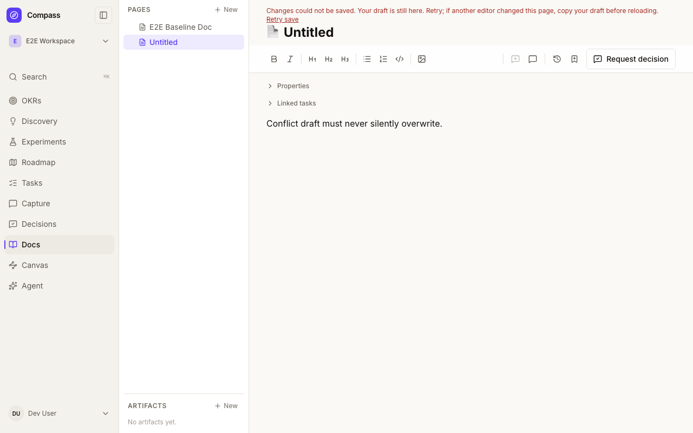
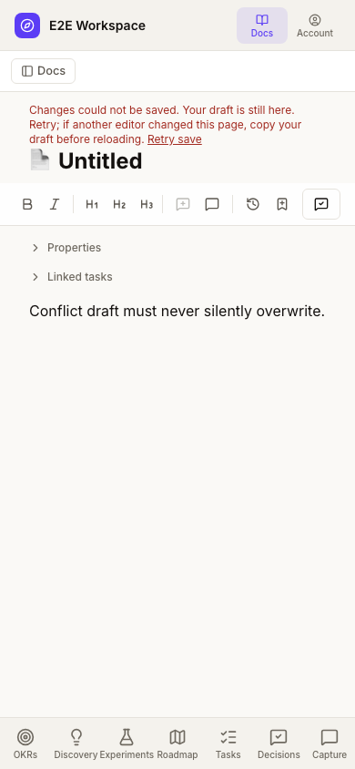

# Geode document storage preview pilot

Compass consumes the published npm package [`@rbcodelabs/geode-headless`](https://www.npmjs.com/package/@rbcodelabs/geode-headless), pinned to exactly `0.1.0` in `package.json` and the pnpm lockfile. Node 22 is required. The release artifact was verified at Geode commit `365438bd38a815dfa1d5230074c395e5ae45f065`. It is byte-identical to the previously verified preview tarball from [Geode SDK PR #268](https://github.com/rbcodelabs/geode/pull/268), original source commit `7fc2c7bc15e015c07a4ad27352833691f43ddc1f`.

Expected SHA-512 integrity (verified against both the registry and the former vendored tarball):
`sha512-gaBHsRTB3NCScAtzHoD0TuLg/gTL+iGJlFyGdtchNpFFvKuT0YSOloco72GvgR9xzD0jZQUnqYzwMt8/ufodZQ==`

The package includes its MIT license, documentation, ESM exports and TypeScript declarations. The SDK's independent Node 22 consumer proof is `npm run proof:headless-package` in the Geode repository. A registry dependency does not enable this pilot or authorize a production rollout.

The SDK owns immutable UTF-8 bodies and verifies their namespace, digest and length. Compass owns authorization, document identity, metadata, hierarchy, history, and the current content reference in DSQL. A body is uploaded before the atomic Compass transaction updates its reference, revision, history and operation receipt. Failed transactions leave the previous document current. The private Blob write-ahead inventory is not authority to delete objects.

## Enabling an isolated preview

Enable only in an explicitly owned PR/commit schema with a synthetic workspace. The ordinary shared `compass_preview` schema is deliberately rejected. There are two distinct modes; neither may silently fall back to the other. Required server environment:

- `PREVIEW_AUTOMATION_ENABLED=1`, `VERCEL_ENV=preview`, valid PR and commit metadata from the preview controller.
- `GEODE_DOCS_PILOT_WORKSPACE_ID`: that synthetic workspace UUID.
- `GEODE_DOCS_BLOB_TOKEN`: an explicitly supplied private-store token.
- `GEODE_DOCS_BLOB_PREFIX`: `geode_docs_` followed by the first 40 hex characters of SHA-256 of `<active-schema>:<workspace-id>`, followed by `/`. Use `documentBlobPrefix(workspaceId)` to compute it.

### Migration path and release order

**Scoped-role mode (existing default):** isolated previews return HTTP 404 from `/api/admin/migrate` when `PREVIEW_AUTOMATION_ENABLED=1`. Use the existing preview controller's scoped migration worker (`scripts/preview-automation/migrate.ts`), not the administrative endpoint. The controller provisions the exact PR/commit schema first; the worker uses its dedicated `<schema>_migrate` role and the registered migration runner with `preProvisionedSchema: true`. Follow [the controller runbook](../../scripts/preview-automation/README.md), including permission probes and lease ownership. Managed credentials must not be passed to this scoped-role worker.

**Vercel-managed mode (explicit risk-accepted pilot):** set `PREVIEW_DATABASE_MODE=vercel-managed` only on the approved pilot branch. This reuses the existing Vercel-managed connection rather than claiming unavailable dedicated IAM-role isolation. The credentials can retain access outside the pilot schema: separation is enforced by reviewed application code, not database permissions. See [the managed-mode decision](../decisions/0017-vercel-managed-docs-pilot.md).

Managed mode is restricted to first-party Compass PR276, branch `feat/geode-docs-preview-pilot`, and valid Vercel preview deployment/commit metadata. It derives `compass_pr_<PR>_<sha12>` server-side and rejects `PGSCHEMA` or `DATABASE_URL` overrides. Configure UUIDs `PREVIEW_MANAGED_RUN_ID` and `PREVIEW_MANAGED_WORKSPACE_ID` before deployment; `GEODE_DOCS_PILOT_WORKSPACE_ID` must identify that same workspace. Use only a verified existing private preview-only Blob store with the exact schema/workspace-derived prefix, never a generic or production storage-token fallback. Stop if the store or its scoped token cannot be verified; this pilot does not authorize creating paid resources.

The manual managed controller uses the authenticated `/api/admin/migrate` API on the verified immutable deployment. It initializes an ownership marker, refuses existing unowned schemas, and applies explicit registered migration names with durable serialization. It never accepts arbitrary SQL, host, or schema from a request. Review the complete baseline manifest: a fresh schema needs more than059. In managed mode, omit001's exact legacy `CREATE SCHEMA IF NOT EXISTS "public"` statement; reject other escaping/global DDL. Preserve ordinary production migration behavior. A timeout or HTTP202 does not mean completion: inspect durable status, ownership and unfinished work before continuing the exact migration. Never run a blanket migration POST or blindly retry an uncertain request.

Before enabling synthetic document writes, verify the complete baseline, all expected indexes, `059_geode_document_storage` health, and absence of pending migrations or unresolved attempts. Signed bootstrap must enforce readiness server-side. The057 token/consent reset must finish before any synthetic fixture is admitted. A READY Vercel build or migration receipt alone does not establish an enabled, verified pilot.

Only the Ed25519 public key belongs in the deployment. The private key stays with the manual controller. Signed grants remain bound to the immutable deployment origin, operation and fixed run, with expiry and nonce replay protection. Convenience preview login and ordinary sessions must not bypass managed-run authorization. Teardown revokes access but retains managed schema data and object inventory. Do not enable recurring workflows as part of this manual pilot.

Production remains outside this pilot. Any later integration release needs a separately approved two-stage rollout: deploy migration-only support while retaining the old Prisma models and Docs behavior, apply and verify the exact registered migration through the authenticated production endpoint, then deploy the integration with pilot flags still disabled. New Prisma document reads require the added columns even when the pilot is off. Do not deploy the full integration before schema readiness, backfill existing bodies, or treat this runbook as authorization for production changes.

For this rollout, production059 has already been applied and verified. Recheck its read-only health before integration release; do not rerun it or apply unrelated pending migrations.

Only new documents in that workspace use Geode. Existing rows remain database-backed, without backfill. The body limit is 1 MiB. Loss of storage access is an error; Compass does not substitute empty or stale content. Disabling the pilot therefore makes existing Geode documents unavailable until the same configuration is restored.

MCP create requires a UUID `operationId`; pilot updates, snapshots and restores also require `expectedRevision` from `get_doc`. Keep the same operation ID and identical payload on a transport retry. A changed payload or authenticated actor cannot reuse an operation ID. Conflicts require reading the latest document and consciously resubmitting. Tool output and browser payloads never include storage references or Blob paths.

## Local verification

Local verification uses the real packaged SDK and real PostgreSQL but substitutes a filesystem object store for private Blob. It is not evidence of an AWS/Blob deployment. The local adapter is refused outside a non-production, non-Vercel process using `E2E_ISOLATED_DATABASE=1` and a localhost `compass_e2e` database.

Prepare the existing functional-test database under its advisory lock, then run:

```sh
pnpm exec tsx scripts/verify-geode-documents.ts
```

This script creates and cleans its own synthetic org/workspace and temporary object directory. It exercises registered migration `059_geode_document_storage` twice, checks catalog postconditions, tests operation replay and changed-payload refusal, races two edits, injects a database failure after upload, restores named history, reads through a fresh process and replays deletion.

The separate `scripts/verify-geode-document-migration.ts` proof requires the migration-only revision and its **old** Prisma client. Do not run it with the integration client's new document fields or reinterpret its refusal as a migration failure. It verifies old-client Docs behavior before and after059, exact legacy content preservation, partial-DDL recovery, idempotence and catalog drift. Retain that version-specific evidence separately from the new-client proof. Neither script accepts a cloud database URL; their exact local fixture cleanup is not authorization to delete retained hosted pilot data.

For the browser fixture, provide `GEODE_DOCS_LOCAL_ROOT` as an existing absolute temporary directory and set `GEODE_DOCS_PILOT_WORKSPACE_ID` to the synthetic fixture workspace. Use the existing functional E2E runner and its database lock. Node 22 is required. The local object adapter hashes logical keys, rejects symbolic links and atomically links completed immutable files.

## Cleanup and rollout

Workspace deletion is blocked while Geode documents, receipts or object inventory remain, or while the workspace is configured as the active pilot. For a cloud pilot: stop writers and unset `GEODE_DOCS_PILOT_WORKSPACE_ID` (redeploy to apply the configuration), export the run evidence, enumerate current and historical references plus pending write inventory, and obtain separate authorization for deletion of that exact isolated prefix. Inventory alone does not identify garbage. Verify removal, then remove only that workspace's synthetic rows and receipts through controlled cleanup. Never delete a shared store or infer permission from a missing document row.

No production storage activation, existing-document migration, public npm publication, desktop sync, attachments migration or cloud-wide search is included. Managed-mode implementation is not hosted verification. Record the exact tested commit/deployment, migration/catalog results, synthetic UI/MCP/private-Blob checks, and revoked-session readback before declaring the pilot verified. Dedicated IAM isolation remains unproven and is not a managed-mode claim.

## Verified error-state layouts

The synthetic local browser journey captures a retained draft after a revision conflict. Retrying does not silently overwrite the other editor's revision; copy the draft before reloading to reconcile it.




